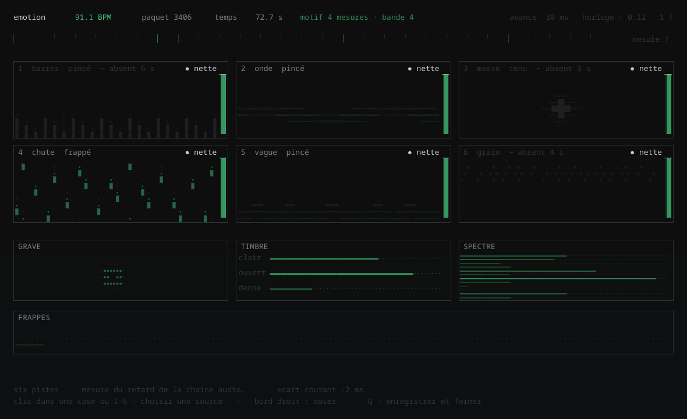
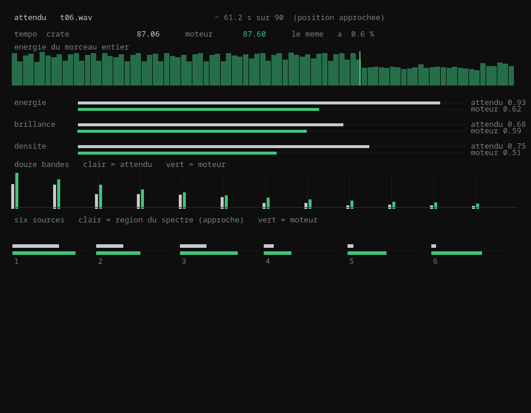
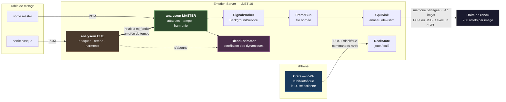
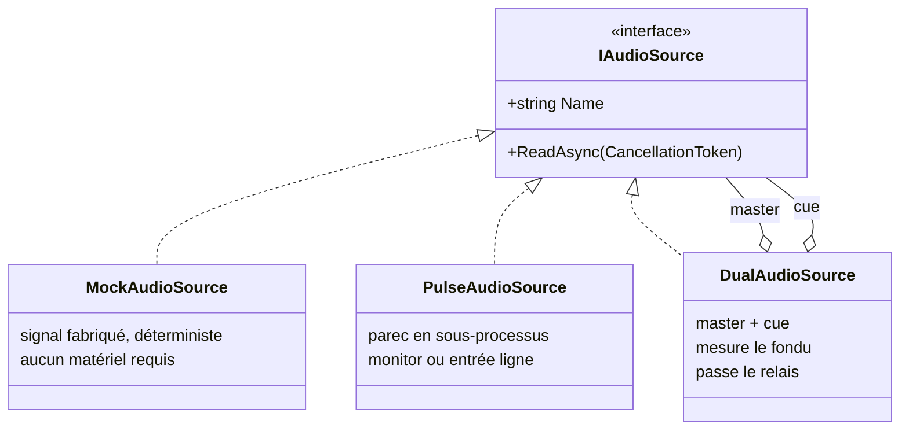
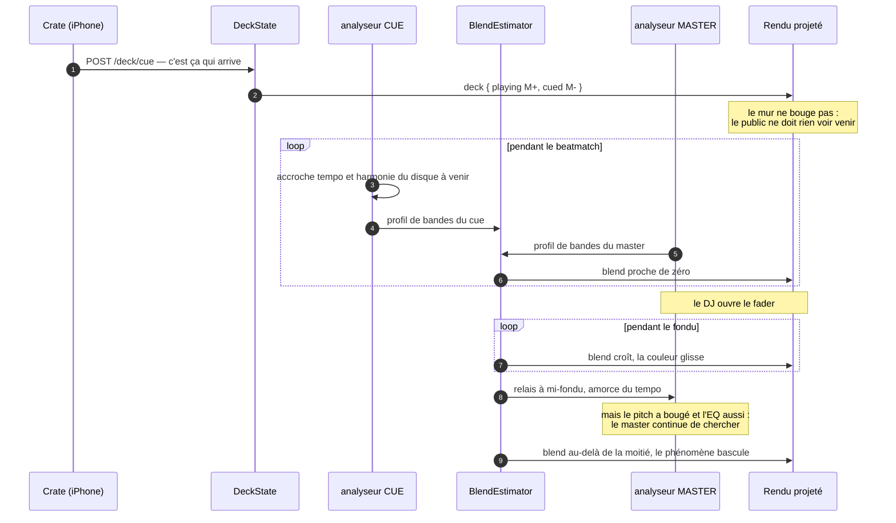
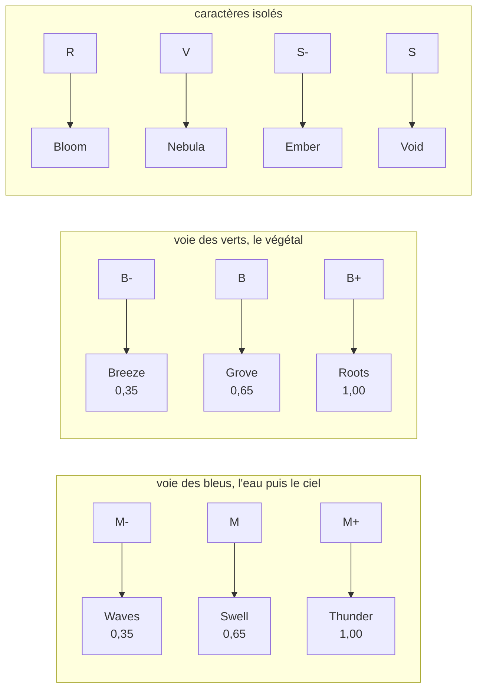
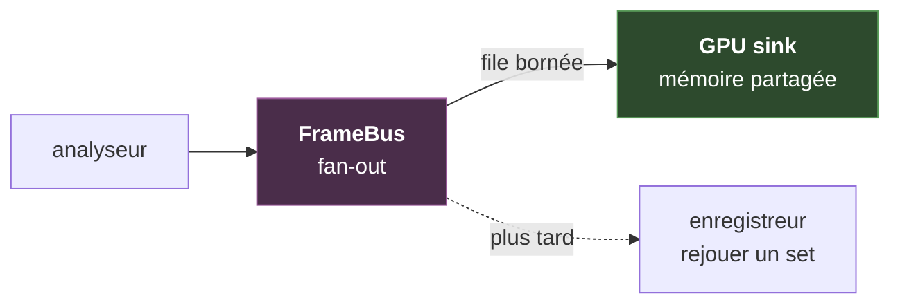

# Emotion Emulator

**Moteur de projection temps réel pour un set de vinyles.**
Aux platines, le DJ pose une face ; le rétroprojecteur en donne le phénomène — des
vagues sur un `M-`, un orage sur un `M+` — animé par le son qui sort réellement des
enceintes.

<table>
<tr>
<td width="50%"><br>
<sub><b>Waves</b> · famille <code>M-</code> · le ressac porte, il ne frappe pas</sub></td>
<td width="50%"><br>
<sub><b>Thunder</b> · famille <code>M+</code> · l'éclair part sur le clap, pas sur le kick</sub></td>
</tr>
</table>

Compagnon de [crate](https://github.com/LiquidSnake0/crate), la base de données du bac
de disques. Les deux se parlent par HTTP, ils ne fusionnent pas.

`.NET 10` · `ASP.NET Core` · `mémoire partagée` · `PulseAudio` · `xUnit` · `Python` · `Qt` ·
**187 tests** · **zéro dépendance tierce dans le cœur** · **21 ms d'analyse**

---

## Voir tourner

Deux fenêtres, et elles ne montrent pas la même chose. **Le mur** est ce que l'unité de
rendu affichera ; **la mesure** dit si ce qu'il affiche est juste. Rien n'y est décoratif :
chaque forme est commandée par une grandeur mesurée, et chaque grandeur est confrontée à ce
qu'une analyse hors ligne indépendante a trouvé sur le même morceau.

<table>
<tr>
<td width="55%"><br>
<sub><b>Le mur</b> · six sources, une forme chacune, aucune deux fois ; le tempo, la mesure
et ce qui se répète en bandeau</sub></td>
<td width="45%"><br>
<sub><b>La mesure</b> · clair = ce que l'analyse hors ligne attend, vert = ce que le moteur
publie au même instant</sub></td>
</tr>
</table>

```sh
./outils/voir.sh                      # sur la sortie systeme
./outils/voir.sh morceau.wav 90.92    # en rejeu d'un fichier, fiche comprise
```

Le moteur écoute la sortie système : on joue ce qu'on veut avec son lecteur habituel, il
suit. La fenêtre de mesure liste le bac, et choisir une face envoie sa fiche au moteur.

**Le rendu ne passe par aucun réseau.** Le moteur publie 256 octets dans `/dev/shm`, la
fenêtre Qt les lit, et l'eGPU les lira sur PCIe ou USB-C — même contrat, sans intermédiaire.
C'est ce qui fait de cette fenêtre une mesure et non une illustration.

---

## Le problème

Un visualiseur audio ne connaît que le son. Il produit donc la même chose pour tout :
des barres qui montent et descendent. Il ignore qu'un morceau est mélancolique ou
massif, parce que cette information n'est nulle part dans le signal.

À l'inverse, un système qui ne connaîtrait que la fiche du morceau serait figé. Car un
vinyle **se joue à vitesse variable** : le DJ pitche au fader, ±8 % en usage courant et
jusqu'à ±16 %. Un BPM enregistré en base est faux dès la première seconde.

> ### Le son donne le mouvement. La base donne le caractère.

| Donnée | Source | Pourquoi |
|---|---|---|
| Attaques, énergie, 12 bandes | le **signal** | seule vérité du rythme, insensible au pitch |
| Tempo, hauteurs | le **signal**, dérivés | jamais nécessaires, jamais lus dans une fiche |
| Famille, Camelot, pochette | la **base** | plus fiable qu'une détection, et stable pendant un fondu |

Le dernier point va contre l'intuition « détectons tout », et mérite d'être défendu.
Estimer une tonalité en temps réel sur un mix est peu fiable en général et **impossible
pendant une transition** : deux disques superposés produisent un accord qui n'existe dans
aucun des deux. La saisie manuelle est ici plus juste que l'algorithme.

**Validation croisée obtenue en écoute réelle** — deux analyses indépendantes, l'une
lisant le bac et l'autre écoutant le vinyle, tombent d'accord :

| Mesure | Résultat | Fiche |
|---|---|---|
| Écart médian du kick | 683 ms → **87,8 BPM** | 87 BPM |
| Classes de hauteur dominantes | sol · si · fa# · la | `9A` = **mi mineur** |

Les quatre notes trouvées appartiennent toutes à mi mineur. Le système n'a jamais lu la
fiche.

---

## Architecture



### Deux canaux, et un seul est un réseau

Les commandes passent par **HTTP**, les images par un **anneau en mémoire partagée**. Ce
ne sont pas deux fois le même canal par négligence : ce sont deux besoins opposés, et les
mélanger dégraderait les deux.

Il y a eu un temps une connexion SignalR, parce que le rendu était une page servie par ce
processus. Elle est partie avec elle. **Le rendu ne traversera jamais un réseau** : l'unité
de rendu lit les 256 octets là où ils sont écrits, aujourd'hui une fenêtre Qt sur la même
machine, demain un eGPU sur PCIe ou USB-C.

| | Commande `/deck/cue` | Image publiée |
|---|---|---|
| Fréquence | quelques dizaines par set | ~47 par seconde |
| Réponse attendue | oui, l'état résultant | aucune |
| Perte tolérable | **non** | **oui** — la suivante arrive dans 21 ms |
| Ordre | strict | sans importance |

Conséquence pratique décisive : **Crate n'embarque aucun client temps réel**. Un `fetch`
suffit pour commander, la PWA reste légère, et le même appel se teste en une ligne de
`curl` depuis les platines.

C'est une séparation commande/événement au sens du découpage des responsabilités.
Ce **n'est pas du CQRS** au sens strict, et le prétendre serait malhonnête : il n'y a ni
modèle de lecture distinct, ni magasin séparé, ni projection asynchrone. L'état tient
dans un enregistrement immuable de quelques champs. Du CQRS ici ajouterait de la
cérémonie sans résoudre le moindre problème réel — la question n'est pas de savoir si le
motif est prestigieux, mais s'il paie son coût.

### Ports et adaptateurs, sur la seule frontière qui bouge

`IAudioSource` est **la seule abstraction du projet**, placée exactement là où
l'incertitude est maximale : d'où vient le son.

```csharp
public interface IAudioSource
{
    string Name { get; }
    IAsyncEnumerable<VisualFrame> ReadAsync(CancellationToken ct);
}
```



`IAsyncEnumerable` plutôt qu'un événement : le flux est **tiré**, pas poussé. Un
consommateur lent ne noie donc pas le producteur, et l'annulation coopérative arrête
proprement le sous-processus par le `finally` de l'itérateur.

**Le mock n'est pas un échafaudage jetable.** Il sert à deux choses qui survivront au
branchement de la table : construire et régler tout le rendu sans matériel, et **rejouer
une séquence à l'identique** — à graine égale, le signal est le même à la milliseconde
près, ce qui permet de comparer deux versions d'un visuel sur exactement le même passage
au lieu de juger à l'œil sur deux écoutes différentes.

Le jour de la vraie table, **une seule ligne change** dans `Program.cs`.

### Le sous-processus assumé

`PulseAudioSource` lance `parec` et lit du PCM `s16le` sur sa sortie standard, plutôt
qu'une liaison native. Compromis explicite — coût : un processus fils et une dépendance
à un binaire système ; gain : aucune bibliothèque native à compiler par plateforme, et
**le même adaptateur pour les deux usages**, seul le périphérique change :

```
alsa_output.….monitor       ce qui sort des haut-parleurs   → essai sans matériel
alsa_input.…analog-stereo    l'entrée ligne                  → table branchée
```

Ce n'est pas un contournement : c'est ce qui a permis de valider la chaîne complète sur
un portable, sans rien acheter.

> **Piège rencontré, et il vaut d'être connu.** `RedirectStandardError = true` sans
> jamais lire stderr : quand le tampon du tube se remplit, `parec` se bloque en écriture
> et **cesse d'alimenter stdout**. Le flux s'arrête sans la moindre erreur. Il est
> désormais drainé en continu, et `parec` est relancé s'il meurt — un set ne doit pas
> mourir parce qu'un câble a bougé.

---

## La chaîne de traitement du signal


### HPSS : séparer avant d'analyser

Dans un spectrogramme, les deux familles de sons laissent des traces **perpendiculaires** :

```
fréquence
   ^
   |   |        |         une percussion : trace VERTICALE
   |   |        |         large en fréquence, brève dans le temps
   |───────────────────   une note tenue : trace HORIZONTALE
   |   |        |         étroite en fréquence, longue dans le temps
   +─────────────────> temps
```

D'où la méthode : une **médiane le long du temps**, à fréquence fixe, conserve ce qui
dure et efface ce qui passe — c'est l'harmonique. Une **médiane le long des fréquences**,
à instant fixe, conserve ce qui s'étale et efface ce qui est étroit — c'est le percussif.

La médiane et non la moyenne, parce qu'elle est insensible aux valeurs extrêmes : c'est
précisément ce qu'on veut, puisque l'autre composante **est** la valeur extrême dont il
faut se débarrasser.

Les deux chaînes en profitent : les attaques travaillent sur le percussif seul, le
chromagramme sur l'harmonique seul. Masques de **Wiener** plutôt qu'un choix binaire —
un masque binaire attribuerait chaque bin entier à l'une des composantes et laisserait
des trous nets dans le spectre ; les masques doux répartissent proportionnellement au
carré, et leur somme vaut exactement l'original (un test le vérifie).

**Mesure sur `instamata`, même morceau, séparation coupée puis active :**

| | sans HPSS | avec HPSS | cible |
|---|---|---|---|
| BPM du kick | 112,1 | **90,6** | 87 |
| erreur | +29 % | **+4 %** | — |
| régularité (écart-type des écarts) | 187 ms | **156 ms** | plus bas = mieux |

Le piano remplissait les médiums de flux en permanence et brouillait la détection ; les
percussions salissaient en retour le chromagramme. Séparer nettoie les deux d'un coup,
au lieu d'ajouter une correction à chacune.

**Le prix est une latence**, et elle est structurelle : pour savoir si un bin durait, il
faut avoir vu la suite. Elle est annoncée par `LatencyFrames` plutôt que subie, et la
séparation se coupe par configuration — `Signal__Separate=false` — pour pouvoir comparer
avec et sans sur le même morceau.

### Le retard, ou la leçon la plus utile du projet

Deux étages retardent la détection, et j'avais réglé chacun sans jamais additionner leur
total :

| Étage | Version initiale | Corrigée |
|---|---|---|
| HPSS — voir si un bin *durait* demande de voir la suite | 3 fenêtres = 64 ms | 1 fenêtre = 21 ms |
| Détecteur — un sommet ne se reconnaît qu'après | 3 fenêtres = 64 ms | 1 fenêtre = 21 ms |
| **Total** | **128 ms** | **43 ms** |

L'œil décroche vers 40 ms : un éclair arrivant un huitième de seconde après le clap ne
paraît plus lié à lui du tout. Le symptôme était formulé ainsi par l'utilisateur — *« l'orbe
au milieu est le seul truc bien calé, les éclairs c'est trop chelou »* — et il avait
entièrement raison. L'orbe suit les graves **en continu**, sans aucune détection : il ne
peut pas être en retard. Tout ce qui passe par une décision l'était.

**Et le raccourcissement a amélioré la détection au lieu de la dégrader :**

| | 128 ms de retard | 43 ms |
|---|---|---|
| BPM du kick | 90,6 | **87,6** |
| Écart médian | 662 ms | **685 ms** |
| *Cible* | *87 BPM · 690 ms* | |

Des fenêtres plus courtes préservent mieux la netteté temporelle de l'attaque. Le
filtrage supplémentaire qu'on payait en désynchronisation ne rapportait rien.

**Puis la séparation harmonique a été coupée par défaut, et le retard est tombé à 21 ms.**
Sur ce répertoire elle coûtait plus qu'elle ne rapportait : mesurée sur un morceau à
barber beats, la corrélation d'autocorrélation du tempo passait de 0,226 sans elle à 0,066
avec — elle effaçait la pulsation d'un genre qui étouffe ses kicks. Elle reste activable
par configuration, pour comparer.

Le retard est désormais **affiché** — `retard 21 ms` dans le nom de la source, en rouge
au-delà de 40 dans l'écran de calage. C'est une grandeur qu'on regarde, pas qu'on subit.

### Le budget complet, du son au paquet

> **48 ms séparent le son du paquet qui part au GPU**, dont 42,6 sont incompressibles et
> 2,2 seulement sont du calcul.

| Étage | Coût | Nature |
|---|---|---|
| capture PulseAudio | **3,3 ms** | subi — mais trois fois moins cher que supposé |
| fenêtre d'analyse | **21,3 ms** | incompressible — il faut l'avoir entendue en entier |
| anticipation du sommet | **21,3 ms** | incompressible — un pic ne se voit qu'après |
| calcul | **2,2 ms** | maîtrisé — 8,8 % du pas de 21,3 ms |
| anneau partagé | **1,5 µs** | maîtrisé — mémoire partagée, sans verrou |

**Le calcul n'est pas le problème.** Il occupe moins d'un dixième du budget ; le reste est
de l'attente pure. Optimiser ici reviendrait à courir plus vite dans une file d'attente —
c'est pourquoi la réponse retenue n'est pas d'aller plus vite mais de **ne plus attendre**,
en prédisant le kick au lieu de le constater.

**Deux chiffres ont été corrigés par la mesure, et dans le bon sens.** La capture était
portée à 20 ms au budget : c'est la valeur *demandée* à `parec`, pas celle obtenue — le
serveur rend 4,4 ms de tampon réel pour 20 demandées, 3,3 pour 5. Et à rebours de
l'intuition, **un tampon court rend le flux plus régulier** : la gigue d'arrivée des blocs
tombe de 3,1 ms à 0,9 en passant de 20 à 5, sans un seul bloc en retard, machine chargée
sur ses huit cœurs et serveur en marche. `EMOTION_CAPTURE_MS` permet de comparer.

### Ce qu'il reste pour l'unité de rendu

Le cas est celui d'une image qui suit un son — l'asynchronie *« vidéo en retard »*, la
mieux tolérée des deux.

| Référence | Seuil | Marge restante |
|---|---|---|
| **Laboratoire — imperceptible** | **20 ms** | **−28 ms** ← la cible |
| [EBU R37](https://tech.ebu.ch/publications/r037) — norme de diffusion | 40 ms | −8 ms |
| [ITU-R BT.1359-1](https://www.itu.int/rec/R-REC-BT.1359) — détectable | 45 ms | −3 ms |
| ITU-R BT.1359-1 — inacceptable | 90 ms | +42 ms |

**La cible est 20 ms**, et non 40. Les normes de diffusion sont écrites pour de la parole
et des plans larges ; ici l'événement est une frappe sèche que le spectateur cherche
activement à voir tomber avec ce qu'il entend, et c'est le cas le plus défavorable —
la détection est possible dès 20 ms sur un transitoire net.

Un vidéoprojecteur consomme 16 à 33 ms selon son traitement d'image ; un modèle de mapping
en mode faible latence descend vers 16, ce qui laisse **une vingtaine de millisecondes**
pour le rendu aller-retour.

**Sauf pour le kick, et c'est ce qui rend la cible atteignable.** L'horloge à verrouillage
de phase ne réagit pas à la frappe, elle la prévoit, et part donc **en avance** — 30 ms
aujourd'hui. Sur cet événement, le retard perçu tombe à `48 − 30 = 18 ms`, **sous le seuil
d'imperceptibilité**.

Cette avance n'est pas bornée par la perception mais par la **prévisibilité du tempo** : à
87 BPM un temps dure 690 ms, donc 30 ms représentent 4 % d'un temps, et 60 ms en
représenteraient 9 %. Tant que le tempo tient à 1 % près, l'avance peut absorber le GPU et
le projecteur en plus — il suffit de l'augmenter d'autant, ce que `?lead=54` permet sans
toucher au code. **Le budget prédictif est large ; c'est la stabilité du plateau qui le
limite, pas l'œil.**

> **Le calcul, avec une unité de rendu et un vidéoprojecteur :**
> `48 ms` d'analyse `+ 10` de rendu `+ 16` de projecteur `= 74 ms` de chaîne.
> Pour viser les 20 ms imperceptibles, l'avance doit valoir **54 ms** — soit 7,8 % d'un
> temps à 87 BPM. L'horloge en accepte jusqu'à 40 %. C'est le défaut ; `?lead=30` remet le
> réglage d'un écran d'ordinateur, où la chaîne est plus courte d'une vingtaine de
> millisecondes et où 54 ferait partir le visuel trop tôt.

### Le poste le plus gros n'est ni dans le code ni dans la machine

**Le son met du temps à traverser la salle, la lumière non.** À 343 m/s, un public placé à
dix mètres des enceintes entend le kick **29 ms après** qu'il en soit sorti, alors qu'il voit
le mur à l'instant même. Ce retard-là joue en notre faveur, et il est plus gros que tout ce
qu'on a optimisé jusqu'ici.

| Distance aux enceintes | Vol du son | Retard visuel perçu (chaîne à 48 ms, sans avance) |
|---|---|---|
| 3 m | 8,7 ms | 39,3 ms |
| 5 m | 14,6 ms | 33,4 ms |
| 8 m | 23,3 ms | 24,7 ms |
| **10 m** | **29,2 ms** | **18,8 ms** ← déjà sous le seuil |
| 15 m | 43,7 ms | 4,3 ms |

Le retard qui compte n'est pas celui du visuel par rapport au son qui **sort de la table**,
mais par rapport au son qui **arrive aux oreilles**. L'avance doit donc en être diminuée,
sans quoi elle ferait partir le mur trop tôt : 54 ms d'avance à dix mètres feraient
précéder le visuel de 35 ms, ce qui se détecte aussi. `?salle=10` donne la distance moyenne
du public aux enceintes, et l'avance s'ajuste.

**Conséquence contre-intuitive : plus la salle est grande, plus c'est facile.** À quinze
mètres, la chaîne actuelle est déjà synchrone sans aucune avance. C'est en petit club, le
public collé aux enceintes, que le budget se resserre.

### Le calage se fait depuis la piste, pas depuis la table

Tout ce qui sépare le son du mur s'additionne en un seul nombre, et personne ne connaît le
retard d'affichage de son projecteur ni la distance moyenne de son public. Mais **tout le
monde voit si une forme tombe avec la frappe ou après**. Un curseur, un repère, et l'œil
tranche — c'est ce que font les jeux de rythme et les amplis home cinéma.

L'écran de calage (touche `C`) est l'instrument : **tout y est immobile sauf ce que le son
déclenche**. Les flèches `←` `→` déplacent l'avance de 5 ms, et la valeur est gardée d'une
soirée à l'autre. Il affiche quatre chiffres, et un seul est réglable :

| Affiché | Sens | Réglable |
|---|---|---|
| **retard perçu** | ce qui reste après avance et vol du son | — |
| **grille** | verrouillée ou en recherche, avec sa fiabilité | — |
| **retard analyse** | ce que la chaîne coûte | — |
| **avance** | ce qu'on lui rend | **oui, `←` `→`** |

**Ne devient réglable que ce qui se juge à l'œil sur place.** L'avance, oui : on voit une
forme tomber avec la frappe ou après. La fenêtre d'analyse, l'anticipation du sommet, le
nombre de sources séparées — non. Les mettre sous un curseur reviendrait à demander
d'arbitrer, en pleine installation, entre vingt millisecondes de latence et quinze points de
verrouillage, sans rien pour en juger. Ces choix-là se tranchent sur des mesures hors ligne,
et le dépôt garde la trace de ceux qui ont été testés puis rejetés.

En revanche ils **s'affichent**, et c'est ce qui permet de dire, avant que les gens
arrivent, si la chaîne tient dans cette salle-là.

**Mais le réglage dépend d'où l'on écoute**, et c'est un piège :

| Position | Vol du son |
|---|---|
| à la table, collé aux enceintes | 5,8 ms |
| au bord de la piste | 14,6 ms |
| au milieu du public | 29,2 ms |

Régler depuis la table pour un public à dix mètres fait **précéder le mur de 23 ms** — un
écart plus grand que tout ce que l'analyse a gagné en une soirée de mesures. Le réglage
passe donc aussi par le téléphone (`POST /lead`) : on se place où sera le public, on regarde
le mur, on corrige. C'est le seul endroit d'où le jugement soit juste.

**Et il faut le master ouvert, pas le casque.** Au casque le son est à l'oreille
instantanément, donc le vol disparaît et l'avance obtenue serait trop grande une fois dans
les enceintes. Le cue passe d'ailleurs par un second analyseur : ce n'est pas le chemin
qu'on cherche à caler.

### Ce qui reste non mesuré

**Le trajet table de mixage → carte son.** Une sortie booth analogique n'ajoute
quasiment rien ; une liaison USB ajoute une conversion et un transport qui n'ont jamais été
chronométrés ici. Ce qui compte est le **différentiel** entre les deux sorties de la table —
celle qui va aux enceintes et celle qui vient à l'analyse — et non la latence absolue de
l'une ou de l'autre.

**Deux défauts trouvés en vérifiant ce mécanisme, et ils annulaient tous deux l'avance.**
Le paramètre était reçu par l'horloge puis **multiplié par zéro** : documenté, transmis, et
sans effet. Et une fois corrigé, l'avance obtenue restait courte — 23 ms pour 30 demandées —
parce qu'on ne peut tirer qu'aux réveils de la boucle de rendu, soit une fois toutes les
16,7 ms à 60 images par seconde : on rate donc en moyenne une demi-image. L'horloge
anticipe désormais cette demi-image, et rend 28,7 ms pour 30 demandées, 60,2 pour 60.

Tout ce qui n'est pas périodique — clap irrégulier, voix, rupture — subit les 48 ms et ne
peut pas être avancé : prédire l'imprévisible inventerait des événements, ce qui est pire
qu'un visuel en retard.

**Une seule économie a été cherchée et rejetée.** Supprimer l'anticipation du sommet
retirerait 21,3 ms, la plus grosse disponible : les détections tombent alors de 1003 à 683
et le verrouillage de la grille de 85 % à 70 %. Or c'est ce verrouillage qui permet de
prédire — raccourcir casserait ce qui compense.

**Fenêtre de Hann.** Sans elle, une note qui ne tombe pas exactement sur un bin fuit sur
tout le spectre et les bandes graves se remplissent de bruit d'aigu.

**FFT écrite à la main.** Le projet a besoin du module du spectre d'une fenêtre, 47 fois
par seconde. Une dépendance de calcul scientifique pour cela coûterait plus en surface
qu'elle ne rapporte. 60 lignes, un test qui vérifie qu'une sinusoïde pure produit son pic
au bon bin.

**Bandes logarithmiques**, 30 Hz à 16 kHz. L'oreille entend le *rapport* entre deux
fréquences, pas leur différence : douze bandes linéaires donneraient onze bandes d'aigus
et une seule pour tout le grave. On prend le **pic** de chaque bande, jamais la moyenne —
sur une bande large, une moyenne noie la pointe, or c'est la pointe qui se voit à l'écran.

**Trois conditions pour une attaque**, et il faut les trois.

1. **Franchir un seuil adaptatif.** Chaque valeur est comparée à la moyenne des ~0,9
   dernières secondes, pas à une constante. Un seuil fixe marcherait sur un morceau et
   raterait le suivant, puisque le crate va d'un ambient feutré à des batteries sèches.
2. **Être un maximum local.** C'est la condition qui manquait, et son absence se
   mesurait : l'écart médian tombait à 510 ms quand l'écart minimal imposé valait 426 ms.
   *Quand les deux se rejoignent, le détecteur ne détecte plus rien* — il déclenche dès
   qu'il en a le droit, et c'est la contrainte qui sert de métronome. Prix : 64 ms de
   retard, sous le seuil de perception d'un décalage son/image.
3. **Respecter un écart minimal**, pour ne pas compter deux fois la même frappe à cause
   de sa résonance.

**Tempo par vote, jamais par moyenne.** Les écarts entre attaques sont arrondis à 10 ms
et votent. Une moyenne serait détruite par une seule attaque manquée, qui doublerait un
écart ; un vote laisse les erreurs se disperser pendant que la bonne valeur s'accumule.
Il faut qu'un tiers des écarts soient d'accord — **en dessous, on préfère ne rien dire**.
`Bpm` est `float?`, et le renderer sait tourner sans lui.

**Repli d'octave.** 87 et 174 BPM produisent les mêmes intervalles si une frappe sur deux
est plus marquée. On replie vers 70–110, une plage qui décrit **le répertoire** et non un
morceau : l'ambiguïté est levée sans jamais lire une fiche.

**L'harmonie a besoin d'une fenêtre quatre fois plus longue**, et c'est le point clé. Les
deux analyses ont des besoins opposés : une attaque demande une fenêtre courte pour
rester nette dans le temps, une note demande une fenêtre longue pour être précise en
fréquence. C'est la **limite de Gabor**, pas un défaut d'implémentation. À 1024 points un
bin vaut 47 Hz et tout l'aigu du piano s'écrase ; à 4096, il vaut 11,7 Hz et les
demi-tons se séparent au-dessus de 200 Hz.

---

## La transition : une mesure, pas un bouton

Une transition de DJ n'est pas un instant, c'est un geste — le fader monte pendant huit
ou seize mesures. Le visuel doit **suivre ce geste**, pas l'annoncer.



`BlendEstimator` corrèle la **dynamique** des deux entrées pour savoir quelle part du
préparé est déjà passée dans le mélange. On ne mesure pas la position du fader mais son
effet : à mi-course sur un morceau discret, il ne se passe pas la même chose qu'à
mi-course sur un morceau massif.

> **Le centrage se fait bande par bande, et c'est le point délicat.** Une première
> version centrait sur la moyenne globale : la mesure saturait à 1 **fader fermé**. Ce
> n'était pas un bug mais une propriété de la musique — deux morceaux quelconques ont
> tous deux plus d'énergie dans les graves, donc leurs profils se ressemblent par
> construction, et cette ressemblance n'apprend rien. En retranchant la moyenne propre à
> chaque bande, il ne reste que la dynamique : où ça monte, où ça descend, à quel moment.
> C'est elle qui porte le rythme, donc qui identifie un disque dans un mélange.

**La relation n'est pas linéaire, et il ne faut pas la rendre linéaire.** À fader
mi-course, la mesure vaut déjà ~0,8 : c'est correct, parce qu'à mi-course le nouveau
morceau domine déjà la perception. Le visuel suit l'effet sur l'oreille, pas la position
mécanique du potentiomètre.

**Le relais amorce, il ne verrouille pas.** À mi-fondu le master reprend le tempo du cue
comme point de départ — un estimateur parti de rien met une à deux secondes à accrocher,
et ces deux secondes tomberaient en plein milieu du passage le plus visible du set. Mais
le master a bien à découvrir : **le pitch a bougé pendant le beatmatch**, c'est même le
but du geste, et l'EQ de la table modifie le spectre entre le casque et la sortie.
`Adopt` n'amorce donc qu'un tiers de la mémoire du vote. Un test le vérifie : cue à 87,
disque réellement pitché à 94, le master converge vers 94.

---

## Le modèle des platines

Une contrainte de métier qu'aucune considération technique ne peut arbitrer : le DJ cale
son prochain disque **au casque**, pendant que le précédent joue encore. Si la projection
changeait au moment où il sélectionne, le public verrait le beatmatch commencer —
c'est-à-dire la coulisse.

```csharp
public sealed record Deck(TrackContext Playing, TrackContext? Cued)
{
    public Deck Cue(TrackContext next) => this with { Cued = next };
    public Deck Take() => Cued is null ? this : new Deck(Cued, null);
    public Deck Drop() => this with { Cued = null };
}
```

| Geste | Endpoint | Effet sur le mur |
|---|---|---|
| Poser une face | `POST /deck/play` | bascule |
| Caler au casque | `POST /deck/cue` | **aucun** |
| Transition faite | `POST /deck/take` | bascule |
| Renoncer | `POST /deck/drop` | aucun |

Trois détails défensifs, chacun couvert par un test :

- `Take()` sans rien de calé **ne coupe pas la projection**. Un geste de trop en plein
  set ne doit pas éteindre le mur.
- Une famille inconnue retombe sur `Rest`, jamais sur une exception. Un crate en cours de
  correction contient des familles vides.
- `Deck.Empty` projette un repos : au lancement, avant le premier disque, le mur montre
  quelque chose.

---

## Du caractère au phénomène

`Scene.ForFamily` traduit une famille du bac en phénomène projeté.



**Cette table est une proposition, pas une règle du domaine.** Elle est tirée de la forme
de la palette — deux voies parallèles, du clair au foncé, plus quatre familles isolées —
et non d'une intention écrite. Elle se corrige famille par famille, à l'écoute.

**L'intensité ne choisit pas le visuel : elle décide s'il part.** Sur un `M-` la moitié
des occasions passe sans rien, ce qui laisse respirer ; sur un `M+` presque tout se
déclenche. La montée d'un set se voit donc à la densité de l'écran autant qu'à sa
couleur.

Les enums partent par leur **nom**, jamais leur rang : un jour une valeur sera insérée au
milieu, et un renderer qui compare des entiers changerait de phénomène sans que rien ne
le signale.

---

## Séparer les sources, et savoir ce qu'on en sait

Douze bandes de fréquence décrivent un spectre ; elles ne décrivent pas une scène. Un kick
et une basse tombent dans la même octave, un piano et un saxophone aussi — et deviennent
alors une seule grandeur, donc une seule forme. Tout ce que l'oreille distingue entre eux
disparaît.

La séparation se fait donc **par le timbre** et non par la fréquence, avec une
factorisation en matrices positives : le spectrogramme récent est décomposé en un petit
nombre de profils spectraux et de leurs activations. Un profil est un timbre ; son
activation dit quand il joue.

> **Rien n'est nommé.** Le système ne décide pas qu'une source est un piano — ce qui joue
> dans une bande change d'un disque à l'autre, et annoncer un piano là où passe un
> saxophone est pire que ne rien annoncer. Il dit seulement si la source est assez stable
> pour porter un nom, et laisse la fiche le poser.

### Deux grandeurs, et elles ne disent pas la même chose

Une seule barre portait les deux, et elle trompait.

| Grandeur | Ce qu'elle mesure | Ce qui la fait monter |
|---|---|---|
| **Assez écoutée** | une durée | le temps de jeu effectif de la source |
| **Nette** | une propriété du disque | son profil se retrouve d'un apprentissage au suivant |

Sur un morceau du crate, les six sources sont **toutes assez écoutées entre 4,2 et 8,8
secondes** — avant la fin des seize temps qui font le palier de travail aux platines. Ce
qui varie ensuite, c'est la netteté, et aucune durée d'écoute n'y change rien : si deux
instruments se relaient dans la même bande, elle restera floue après dix minutes comme
après dix secondes.

Confondues, la source la plus grave affichait zéro après 692 observations. On lisait « le
système n'apprend pas » là où il fallait lire « il a fini d'apprendre, et sa conclusion est
que cette bande est partagée ». **Une mesure et un verdict ne se résument pas au même
chiffre.**

### Six sources, et le chiffre est mesuré

L'intuition dit qu'en demander davantage séparerait mieux. La mesure dit l'inverse.

| Sources | Netteté obtenue | Coût d'un apprentissage |
|---|---|---|
| **6** | **0,87 – 0,99** | **167 ms** |
| 9 | 0,85 – 0,92 | 284 ms |
| 12 | 0,76 – 0,92 | 355 ms |

Passé six, la factorisation n'a plus d'objets à trouver et se met à couper des instruments
en morceaux — des morceaux qui ne se retrouvent plus d'une fois sur l'autre. On paierait
donc deux fois pour un résultat moins bon.

### Ce que la netteté ne disait pas, et qu'il a fallu écouter pour voir

La netteté ci-dessus répond à « les six profils se retrouvent-ils d'un apprentissage au
suivant ». La réponse est oui, et elle est solide : **0,77 à 0,91** de cosinus entre deux
passages du même morceau avec la même fiche.

Elle ne répond pas à la question voisine, que personne n'avait posée : **se retrouvent-ils à
la même place ?** Les sources sont ordonnées du grave à l'aigu par leur centre de gravité
spectral, faute de savoir les nommer. Il suffit que deux sources voisines se croisent pour
que tout glisse — et mesuré sur quatre morceaux, **un à trois rangs sur six seulement sont
conservés**.

> La conséquence va loin, et elle n'était pas prévue : **la case 3 de l'écran ne montre pas
> le même instrument d'une lecture du disque à la suivante.** Ce qui est stable, c'est
> l'ensemble des six ; pas leurs places. Une netteté de 0,84 en moyenne et un ordre qui tient une
> fois sur trois sont deux faits compatibles, et le premier masquait le second.

### Écouter ce que chaque source entend

Toutes les mesures du projet disent si une source est **régulière**. Aucune ne dit si elle
contient ce qu'elle prétend contenir — et c'est pourtant la seule question qui compte quand
on affiche six formes en prétendant qu'elles suivent six instruments.

```sh
./outils/ecouter.sh morceau.wav 87.06
```

Les six profils sont exportés par la sonde, l'extraction refait sa propre transformée,
répartit le spectre au prorata et resynthétise avec la phase d'origine. Un WAV par source. Et
à côté, un **témoin** par source : le même morceau passé dans un filtre fixe taillé sur le
même profil. Si `sourceN` et `temoinN` sonnent pareil, la factorisation n'a fait que couper
des fréquences, et « la source du piano » n'est qu'une bande à laquelle on a donné un nom.

**Un outil de validation qui se trompe est pire que pas d'outil**, parce qu'il produit une
preuve à charge contre une pièce qui n'y peut rien. Six contrôles passent donc avant que le
premier fichier soit écrit — dont celui-ci, qui a coûté trois juges successifs :

| recouvrement des trames | pire source, rapportée à son témoin |
|---|---|
| 50 % | **×103** |
| 75 % | ×7 |
| **88 %** | **×5** |

Un masque qui change d'une trame à l'autre module l'amplitude à la cadence des trames. À
recouvrement de moitié — ce que le bon sens suggérait — une source bourdonnait **cent fois**
plus que son témoin. On l'aurait entendue hachée et l'on aurait accusé la séparation.

> **Les trois juges écrits pour cette ligne s'accordent sur un facteur vingt et se
> contredisent sur un facteur trois.** La mesure avait la résolution de trancher le
> recouvrement, elle n'a pas celle de juger ce qui reste : l'outil rend donc trois verdicts,
> dont un qui dit « je ne sais pas ». Prétendre le contraire aurait été tirer des flèches
> jusqu'à ce que l'une aille au milieu.

Et deux résultats sont tombés avant la première écoute : **deux sources sur six portent
presque le même son** sur trois morceaux sur quatre — jusqu'à 0,98 — et sur l'un d'eux les
six centres de gravité tiennent dans une octave et demie. Avec les deux échecs
déjà mesurés — le classement des rôles, le drapeau « absente » — cela fait quatre indices
concordants. **C'est l'oreille qui tranchera**, et c'est exactement pour ça que l'outil
existe.

---

## Faire monter la stabilité

L'instrument construit, il fallait s'en servir. La stabilité valait **33 %** — une fenêtre de
quinze secondes sur trois seulement retrouvait la même période que ses voisines.

### D'abord un diagnostic, pas une intuition

Le détail fenêtre par fenêtre a écarté la première hypothèse d'un coup :

```
  metronome  87.9= 87.8= 87.9= 87.8= 87.8= 87.9= ...
  macro     108.3? 85.0= 86.2= 80.7? 77.3? 81.4? 83.5= 85.8= 87.7? 97.2? 79.1?
```

Ce ne sont **pas** des erreurs d'octave — la tolérance à l'octave donne le même 36 %. C'est un
éparpillement réel de ±6 % autour du tempo.

### Le mécanisme, puis le remède

Le détecteur devient sourd pendant 0,85 temps après avoir tiré. Une bavure au quart du temps
bloque donc le vrai kick qui suit, puisqu'il n'est qu'à trois quarts d'elle ; la détection
suivante tombe un temps et quart plus loin, c'est-à-dire de nouveau au quart du temps.
**Une seule bavure décale durablement tout le train.**

Raccourcir l'écart ne marche pas — mesuré, la force baisse continûment (0,623 → 0,579 → 0,532
→ 0,492) parce qu'on laisse entrer plus de bavures qu'on n'en débloque.

Ce qui marche, c'est de **refuser la bavure**. Le seuil adaptatif comparait la candidate à la
moyenne de la courbe : un plancher, qui dit « il se passe quelque chose » et non « c'est une
frappe comme les précédentes ». On ajoute la seconde question — la candidate doit valoir au
moins une fraction de la médiane des huit frappes déjà retenues.

| fermeté | force | stabilité | couverture | verrouillage |
|---|---|---|---|---|
| éteinte | 0,623 | 33 % | 100 % | 57 % |
| 0,45 | 0,673 | 40 % | 73 % | 52 % |
| **0,55** | **0,695** | **45 %** | **66 %** | **54 %** |
| 0,75 | 0,723 | 42 % | 40 % | — |
| 0,85 | 0,695 | 55 % | 34 % | — |

### La couverture a été ajoutée à l'instrument à cause de ce tableau

À 0,85 la stabilité atteint 55 % — et le nombre de frappes tombe de 1,38 à 0,42 par seconde,
soit **une frappe pour trois temps**. La stabilité était achetée en jetant des images.

C'est le défaut symétrique de celui qu'on reprochait à la justesse : l'une récompensait
l'excès de détections, l'autre récompenserait la disette. La mesure de pulsation compte donc
désormais trois grandeurs, et aucune ne se lit seule — **ce qui est rendu doit être juste,
régulier, et à peu près complet.**

On s'arrête à 0,55 : le meilleur point qui garde deux temps marqués sur trois.

### Ce qu'on espérait et qui n'est pas venu

Le verrouillage ne bouge presque pas — 57 % à 54 %. L'idée était qu'un train plus régulier
aiderait la grille à tenir ; la mesure ne le confirme pas. Elle ne l'infirme pas non plus : on
paie trois points de verrouillage pour douze points de stabilité.

Une variante a été écrite puis retirée : rendre la frappe faible en lui interdisant seulement
d'armer la surdité, pour ne rien perdre à l'écran. Elle ne pouvait pas marcher — la garde de
l'écart minimal se vérifie *avant* tout jugement de force, donc une frappe faible ne passe
jamais pendant la surdité ; il n'y avait rien à débloquer. Elle ne faisait qu'ajouter des
frappes dans les trous, et la mesure l'a dit : 144 marquages pour cent temps, force tombée à
0,357.

**Bilan : 33 % → 45 % de stabilité, 0,623 → 0,695 de force, pour 34 points de couverture.**

## Mesurer la pulsation, et non les événements

Le projet avait deux familles d'indicateurs, et aucune ne répondait à la question qui décide
du détecteur.

Les **indicateurs internes** comparent les frappes à la grille, laquelle se cale sur ces
mêmes frappes : un défaut commun aux deux leur est invisible, et c'est ainsi qu'un retard de
21 ms a survécu des semaines. La **confrontation à `aubioonset`** répond « est-ce un vrai
événement », jamais « est-ce le *bon* ». Un détecteur qui tirerait sur toutes les attaques du
morceau y excellerait tout en rendant la grille inutilisable — c'est exactement ce qu'a fait
le blanchiment adaptatif.

`tools/Emotion.Pulse` pose la troisième question : **ces instants forment-ils un pouls ?**

### Sans tolérance, et sans référence

Une période étant donnée, on replie chaque instant sur un cercle — un tour par période — et
l'on somme les vecteurs unitaires. S'ils tombent tous au même endroit du cycle ils
s'additionnent ; s'ils sont dispersés ils s'annulent. C'est la statistique de Rayleigh, et
elle a deux vertus : **aucune fenêtre de tolérance à défendre**, et un niveau de hasard qui se
calcule au lieu de s'estimer — √π / 2√n pour n instants.

Trois pièges ont dû être traités, et chacun a laissé une trace mesurée dans le code.

**Les sous-divisions.** Des instants posés sur une grille de période P tombent aussi,
exactement, sur une grille de P/2 et de P/3. La force ne peut donc que croître quand la
période raccourcit, et un simple maximum choisirait toujours la plus courte période explorée.
On retient la plus longue des meilleures — puis on affine, parce que la tolérance de 3 % qui
protège des octaves coûtait 1,5 ms de précision, soit 0,13 temps de dérive sur soixante
frappes.

**La dérive de tempo.** Mesurée sur un vrai morceau, la force valait **0,062 à 690 ms et
0,268 à 696 ms**. Huit dixièmes de pour cent, et le score s'effondre : il y a cent trente
temps dans quatre-vingt-dix secondes, donc 0,8 % d'erreur accumule un temps entier de dérive.
Une mesure globale exigerait un tempo constant au millième — ce qu'un vinyle joué au fader
n'est jamais. On découpe donc en fenêtres de quinze secondes et l'on prend la médiane.

**La régularité n'est pas la justesse.** Un détecteur qui tire sur les contretemps a des
intervalles impeccables et un visuel faux. L'accord contre un pouls de référence vaut alors
**−1** : c'est la seule grandeur du projet qui sache distinguer ce cas d'un détecteur juste.

### Ce que l'instrument dit du détecteur

Validé d'abord là où la réponse est connue — sur le métronome fabriqué : force **0,973**,
stabilité **100 %**, 87,3 BPM pour un vrai 87,85.

Puis sur les treize morceaux, en comparant les deux détecteurs en litige :

| | force | stabilité |
|---|---|---|
| étroit | 0,623 | 33 % |
| blanchi 0,8 | 0,645 | 34 % |
| le blanchiment gagne sur | 8/13 | 4/13 |

**Match nul.** La seule mesure qui pose la bonne question dit que le blanchiment ne change
rien à la pulsation — il trouve simplement plus d'événements, dont beaucoup ne sont pas des
temps. L'étroit reste, cette fois pour une raison démontrée et non par défaut.

Et le vrai chiffre est ailleurs : **33 % de stabilité sur du disque contre 100 % sur le
métronome.** Une fenêtre de quinze secondes sur trois seulement retrouve la même période que
les autres. C'est l'état réel du détecteur, c'est enfin une cible qui ne se juge pas
elle-même, et c'est là-dessus que tout travail suivant devra se mesurer.

## Le retard que nos propres mesures ne pouvaient pas voir

Après avoir retiré le lissage, le détecteur battait sur le temps mais gardait 0,185 temps
d'erreur de phase — 127 ms, six fenêtres d'analyse. Plusieurs pistes ont été essayées et
n'ont rien donné. La bonne question était ailleurs : **contre quoi mesure-t-on ?**

Tous les indicateurs comparent les frappes à la grille, et la grille se cale sur ces mêmes
frappes. Un décalage commun aux deux leur est invisible. Il fallait sortir.

**Première référence : un métronome fabriqué.** 90 secondes à 87,85 BPM exactement, kick sur
chaque temps, clap sur 2 et 4, charley sur les croches. La chaîne y est irréprochable :

```
  intervalles sur la grille   100 %
  frappes bien calées         100 %
  justesse de phase           0,004 temps = 2 ms
  période de la grille        683 ms · tempo publié 683 ms · écart +0,0 %
```

Donc aucun défaut systématique de calcul. Le problème venait bien de la matière — ou d'autre
chose.

**Seconde référence : une autre implémentation.** `aubioonset` sur les mêmes 90 secondes, et
la comparaison des instants. Le résultat était impossible à ignorer :

| | écart médian | à ±20 ms | hasard |
|---|---|---|---|
| métronome | **+17,3 ms** | 60 % | 12 % |
| macro | +26,8 ms | 17 % | 21 % |
| live | +26,5 ms | 23 % | 12 % |
| instamata | +29,7 ms | 15 % | 19 % |

Sur Macroblank et instamata, **l'accord tombait sous le niveau du hasard**. Et surtout : le
métronome, dont on venait de prouver l'exactitude vis-à-vis de notre propre grille, était en
retard de dix-sept millisecondes sur le monde.

Un décalage constant d'une fenêtre. La cause tenait en une ligne, sous un commentaire qui
décrivait pourtant la bonne intention :

```csharp
var at = tMs + (long)_transient.OffsetMs;
```

Deux erreurs de même sens. La frappe est jugée sur la fenêtre **précédente** — c'est tout le
rôle de `Lookahead`, qui attend la suivante pour confirmer un sommet — il fallait donc
retrancher une fenêtre. Et `_transient.OffsetMs` décrit la fenêtre **courante** : on
corrigeait la position d'une frappe avec le relevé d'une autre. On ajoutait une dizaine de
millisecondes là où il fallait en retirer une vingtaine.

```csharp
var at = tMs - (long)_frameMs + (long)_offsetPrec;
```

| | écart médian | à ±20 ms | hasard |
|---|---|---|---|
| métronome | **+4,9 ms** | **97 %** | 12 % |
| macro | +14,2 ms | **43 %** | 21 % |
| live | +13,0 ms | **55 %** | 12 % |
| instamata | +18,8 ms | **40 %** | 19 % |

Macroblank passe de sous le hasard à deux fois le hasard.

**Et nos mesures internes n'ont pas bougé d'un point** — 50 % d'intervalles justes,
0,185 d'erreur de phase, 67 % de verrouillage, exactement comme avant. C'est logique : en
décalant toutes les frappes de 21 ms, on décale aussi la grille qu'elles calent. Aucun de
nos indicateurs ne pouvait trouver ce défaut, et c'est la leçon la plus utile de la journée.

Le gain est réel malgré cette invisibilité, parce que l'horloge à verrouillage de phase
**prédit** ses temps à partir de la grille : vingt millisecondes de biais sur l'origine
étaient vingt millisecondes de retard sur chaque temps annoncé.

### Deux pistes mesurées et écartées le même soir

Le **domaine complexe** a été rejugé sans le lissage, qui aurait pu masquer son intérêt
puisqu'il détruit précisément les pics d'une seule fenêtre. Même verdict : dès un poids de
0,15 le verrouillage de Macroblank tombe de 67 à 35 %.

Le **blanchiment adaptatif** (Stowell & Plumbley, 2007) traitait un vrai problème : à
44,1 kHz une raie fait 43 Hz, donc les trois bandes du kick n'en couvrent que trois, de 43 à
172 Hz — là où vit la basse. Un kick et une note de basse y tombent ensemble. Le blanchiment
divise chaque raie par sa propre crête récente, ce qui permet de regarder plus large sans se
faire noyer. Balayé de 0,3 à 3,0 : il améliore instamata et live, et dégrade le
verrouillage de Macroblank (67 % → 43-61 %). Gardé, éteint, documenté.

### Il n'y avait pas de « Macroblank contre les autres »

Ce partage — un disque qui veut un détecteur étroit, deux qui en veulent un large — a tenu
une soirée. Il était faux, et il venait des indicateurs internes.

Rejugé contre aubio, le blanchiment améliore la **justesse** sur les trois. Validé ensuite
sur un album entier de Macroblank, dix morceaux jamais servis à régler quoi que ce soit :

| | étroit | blanchi 0,8 | |
|---|---|---|---|
| justesse (accord avec aubio, moins le hasard) | +19 p | **+28 p** | gagne sur 8/10 |
| régularité (sans consulter aucune grille) | 37 % | **41 %** | gagne sur 7/10 |
| verrouillage de la grille | **43 %** | 36 % | **perd sur 8/10** |

**Les trois lignes sont vraies en même temps**, et c'est la leçon. La justesse mesure « est-ce
un vrai événement », jamais « est-ce le bon ». Le blanchiment trouve davantage d'attaques
réelles — c'est vérifié contre une implémentation indépendante — mais ce sont des attaques
quelconques du bas-médium, pas la pulsation. La grille reçoit alors un mélange de temps et de
contretemps et lâche : 84 → 42 % sur une piste, 54 → 20 % sur une autre.

Or c'est le verrouillage qui fait le visuel, puisque l'horloge ne peut prédire — donc
anticiper le retard — que tant qu'elle tient la grille. **L'étroit reste le défaut**, en
sachant désormais que ce n'est pas parce qu'il voit mieux.

Ce qui manque pour trancher vraiment : une mesure extérieure de la **pulsation**, et non des
événements. Ni la justesse ni le verrouillage ne la donnent — la première ignore la
régularité, le second se juge contre une grille calée sur ce qu'il note.

## Le lissage qui supprimait les attaques

Le détecteur d'attaques a été le maillon faible du projet pendant des semaines. Trois pistes
avaient été explorées et rejetées — seuil guidé par la grille, anticipation nulle, domaine
complexe — sans jamais regarder ce qui arrivait *dans* le détecteur.

La courbe du kick était moyennée sur deux fenêtres avant d'être jugée :

```csharp
private float Smooth(int slot, float v)
{
    var s = (_smooth[slot] + v) * 0.5f;    // (précédent + courant) / 2
    _smooth[slot] = v;
    return s;
}
```

La raison paraissait évidente : le flux brut est en dents de scie, et y chercher un sommet
reviendrait à compter le bruit. Mais **une attaque nette ne dure qu'une fenêtre.** Appliqué à
la suite `1, 20, 1`, ce lissage rend `10,5` puis `10,5` — deux fenêtres de valeur exactement
égale. Or le détecteur exige un maximum local *strict* : rien d'aussi haut ni avant ni après.

> Le filtre censé protéger du bruit supprimait en priorité les attaques les plus franches,
> et ne laissait passer que celles qu'il avait assez déformées pour les départager.

Ce que la mesure donne sur quatre-vingt-dix secondes de trois enregistrements :

| | lissé | brut |
|---|---|---|
| **Macroblank** — intervalles justes | 35 % | **52 %** |
| frappes bien calées | 23 % | **33 %** |
| verrouillage | 62 % | **67 %** |
| écart médian entre kicks | 1,21 temps | **1,00 temps** |
| **enregistrement de set** — verrouillage | 58 % | **87 %** |
| **instamata** — verrouillage | 49 % | **73 %** |

**L'écart médian est le chiffre qui tranche.** 1,21 temps n'est ni une noire, ni une croche,
ni rien de musical : c'est la signature d'un détecteur qui rate des frappes et en invente
entre. Il vaut maintenant 1,00 temps. Le détecteur bat sur le temps, ce qu'il n'avait jamais
fait.

La marge du seuil avait été réglée *avec* le lissage, donc plus aucune raison d'être juste
sans lui. Balayée de 1,2 à 3,0 : les intervalles justes de Macroblank culminent à 1,8 (52 %)
et se dégradent des deux côtés — 50 % à 1,2, 42 % à 2,2, 38 % à 3,0. Elle tenait à autre
chose, elle reste.

### Le même défaut, et pourtant la conclusion inverse

Le clap et le charley passent par le même lissage. Le retirer là aussi paraissait acquis —
et ces deux registres comptent au-delà de leur propre éclair, puisque les familles de
frappes sont nourries par `kick || clap || charley`.

| | lissé | brut |
|---|---|---|
| Macroblank — accord avec la grille | **0,43** | 0,01 |
| Macroblank — verrouillage | **67 %** | 50 % |
| instamata — accord avec la grille | 0,00 | **0,65** |

**Rejeté**, sur le seul disque qu'on connaisse bien. La raison était déjà écrite ailleurs
dans le code, à propos des charleys : un registre ne se prête à une lecture franche que s'il
**se vide entre deux frappes**. Le grave se vide ; les médiums et les aigus de ce répertoire
ne se vident jamais, entre le souffle de bande, le crépitement du vinyle et les nappes. Sans
lissage leur courbe n'est plus une suite de pics mais du bruit où chaque fenêtre est un
maximum local — les familles 2 et 3 de Macroblank passaient de ×1,61 et ×2,01, deux rapports
lisibles, à ×2,14 toutes les deux, c'est-à-dire à rien.

Le lissage n'est donc ni bon ni mauvais en soi : il coûte une attaque franche et il achète du
bruit en moins. Le marché est bon là où le fond est chargé, mauvais là où le registre
respire. Les deux interrupteurs restent, avec leurs mesures.

Un dernier essai, écarté lui aussi : prendre le **seuil sur la médiane** de l'historique
plutôt que sur sa moyenne — la moyenne est tirée vers le haut par les pics eux-mêmes, si bien
qu'une salve de frappes fortes éteint le détecteur juste après. Seule, elle aide (Macroblank
35 → 48 %). Cumulée au retrait du lissage, elle dépasse la cible : les détections tombent de
126 à 75. Deux paramètres qui se compensent se règlent sur le bruit du jeu d'essai, pas sur
une propriété du signal. On s'arrête.

## Reconnaître une frappe sans la nommer

Les frappes étaient rangées par hauteur : ce qui tape dans les graves est un kick, dans le
médium un clap, dans l'aigu un charley. Convention utile et grossière — **deux percussions
différentes qui vivent dans la même tranche devenaient le même événement**, exactement comme
deux instruments d'une même octave devenaient une seule forme avant la séparation par le
timbre.

Or une frappe a une couleur propre, et elle est stable. Trois grandeurs la décrivent, prises
**sur la fenêtre où l'attaque tombe** — pas après, sinon on mesurerait la réverbération de la
salle, identique pour toutes :

| | ce que ça sépare |
|---|---|
| **brillance** | un kick d'un charley, et deux caisses entre elles |
| **étalement** | une peau accordée d'une cymbale de même brillance |
| **piquant** | deux frappes de même couleur qui ne durent pas pareil |

Sur un morceau du crate, six familles se dégagent — et **les deux principales ont la même
brillance (0,46 et 0,51) mais un piquant de 0,04 contre 0,23**. Deux percussions que les
bandes de fréquence voyaient comme une seule.

```
  famille 0 :   36 frappes  brillance 0.28 · étalement 0.25 · piquant 0.03
  famille 2 :  147 frappes  brillance 0.46 · étalement 0.42 · piquant 0.04
  famille 3 :  163 frappes  brillance 0.51 · étalement 0.42 · piquant 0.23
  famille 5 :   34 frappes  brillance 0.60 · étalement 0.40 · piquant 0.11
```

**Aucun apprentissage préalable, et toujours aucun nom.** Un classifieur entraîné dirait
« caisse claire » et se tromperait au premier disque sortant de ce qu'il a vu. Ce qu'on veut
est plus modeste et plus robuste : savoir que *cette frappe-ci est la même que celle d'il y a
deux mesures*. Le rendu peut donner à chacune son traitement ; savoir laquelle est une caisse
claire ne l'intéresse pas.

### Vérifier le tempo par une voie qui ne le connaît pas

Tout le projet mesure, mais **rien ne disait si le tempo trouvé était le bon**. La confiance
publiée vient de l'autocorrélation elle-même : elle dit à quel point le pic choisi ressort,
pas s'il est au bon endroit. Une confiance calculée par celui qu'on veut vérifier ne vérifie
rien.

Les familles de frappes donnent cette seconde voie, parce qu'elles sont formées **sur le
timbre et n'ont jamais consulté le tempo**. Or une percussion joue en mesure : ses intervalles
tombent sur des multiples ou des divisions du temps. Sur un morceau du crate à 87,4 BPM :

```
  famille 0 :  85.2 BPM  (×0.97)   le kick, sur le temps
  famille 3 : 175.4 BPM  (×2.01)   les croches, exactement
  famille 5 :  48.5 BPM  (×0.55)   les blanches
```

Trois rapports francs obtenus sans jamais regarder la grille — **c'est une confirmation
indépendante du tempo**, la première dont le projet dispose.

**Mais l'indicateur ne discrimine pas encore, et il faut le dire.** L'accord vaut 0,43 sur
Macroblank et 0,00 sur les deux autres enregistrements. La cause est en amont : les familles
ne sont régulières qu'à 0,22–0,45, parce qu'elles héritent des détections du clap et du
charley — deux registres qui ne se vident jamais sur ce répertoire. **La vérification dépend
donc en partie de ce qu'elle devrait vérifier.**

Corriger le kick a fait passer l'accord de Macroblank de 0,38 à 0,43, ce qui est cohérent
mais modeste. Le même traitement appliqué au clap et au charley a été mesuré et **rejeté** :
il fait tomber l'accord à 0,01 sur la référence. Voir plus haut, `LissageAttaques`.

## Le parallélisme, et ce que la mesure en a dit

La demande était directe : faire calculer les six sources en parallèle, chacune écrivant sa
part de ce qui part au GPU, sans concurrence à arbitrer puisque chacune est isolée.

La **structure de données** a suivi, et elle en valait la peine. Chaque source possède
désormais son mot de huit octets aligné dans le paquet : niveau, contour, drapeaux,
empreinte, forme, nom. Aucune ne partage un octet avec une autre, ce qui rend l'écriture
concurrente sûre **par la forme des données** plutôt que par un verrou.

Deux défauts sont tombés au passage, et aucun test ne les voyait :

- les six attaques vivaient dans **un seul octet commun** — poser un bit s'y fait en lisant,
  modifiant, réécrivant, donc deux sources écrivant ensemble se seraient effacées ;
- les contours des sources 4 et 5 **n'étaient pas transmis du tout**, ce qui expliquait des
  formes qui pulsaient sur place au lieu de suivre leur mélodie.

### Mais répartir six calculs sur six cœurs coûte plus que de les faire

| Mode | Coût par image |
|---|---|
| séquentiel | **17 µs** |
| parallèle | 160 µs |

Réveiller des fils, distribuer, attendre le dernier : cette dépense est fixe et se compte en
dizaines de microsecondes, quand le travail d'une voie se compte en microsecondes. Le
pipeline sait faire les deux, **mesure lequel gagne sur la machine qui l'exécute**, puis s'en
tient au meilleur. Le jour où chaque voie portera sa propre transformée, la balance
s'inversera d'elle-même sans que le code change.

### Le vrai gain était ailleurs, et il était énorme

L'apprentissage des profils tournait dans le fil d'analyse. Il coûtait **268 ms en moyenne
et 605 ms au pire, toutes les 1,4 seconde**, quand une image d'analyse en dure 21 : treize
images gelées d'affilée, puis rattrapées d'un coup, deux fois par phrase.

| | pire image | images au-dessus du pas de 21 ms |
|---|---|---|
| apprentissage dans le fil | 608 ms | 38 |
| **apprentissage en fond** | **17 ms** | **0** |

Il ne calcule pas plus vite — il calcule exactement aussi vite. Il rapporte parce qu'il
calcule *ailleurs* : l'analyse continue de suivre l'image courante avec les profils qu'elle
a déjà, pendant que les prochains se calculent à côté. Un morceau ne change pas de timbre en
trois secondes.

Un seul fil écrit, un seul lit, et jamais la même chose au même moment : l'analyse dépose une
copie du spectrogramme puis n'y touche plus, l'apprentissage travaille sur ses propres
tableaux et publie un résultat, l'analyse le reprend à l'image suivante. **Le seul état
partagé est un drapeau.** Rien à arbitrer, donc rien à verrouiller.

---

## Ce que le casque transmet aux enceintes

Caler une face au casque, c'est reposer l'aiguille au début plusieurs fois pour vérifier le
tempo. Chacun de ces passages est une écoute de plus du même extrait, et leur cumul dépasse
de loin ce qu'une seule écoute continue donnerait. C'est là que le système apprend le plus,
et c'est justement le moment où personne ne regarde l'écran.

Quand la face calée passe aux enceintes, **ce qu'on a appris la suit**. Le master reprend un
disque déjà décrit au lieu de tout redécouvrir au moment où il en a le moins le temps. C'est
le seul instant du système où quoi que ce soit est recopié — une transition est un geste,
pas une boucle.

**Pendant le fondu, le master suit mais n'apprend plus.** Les deux disques sonnent ensemble
et ce qu'il entend est une somme qui n'existe dans aucun des deux : un portrait formé
là-dessus écraserait celui que le casque vient de transmettre. Le rendu, lui, ne s'interrompt
pas — niveaux, contours et attaques continuent de partir à cadence pleine.

### En mémoire vive, et nulle part ailleurs

Une version rangeait ces portraits sur le disque dur, un fichier par face toutes les dix
secondes : 996 octets, ce qui paraît indolore. La mesure a dit autre chose, sur trois
exécutions de chaque :

| | coût médian d'une image | pire |
|---|---|---|
| avec écriture disque | 3,2 ms | 25 – 34 ms |
| **en mémoire vive** | **2,0 ms** | 17 – 21 ms |

**Soixante pour cent de plus pour ranger un kilo-octet.** Reconnaître un disque la semaine
prochaine ne valait pas d'alourdir la soirée en cours. Une face rangée est oubliée.

---

## Pourquoi pas une bibliothèque existante

La question mérite d'être posée avant d'écrire la moindre FFT, et elle l'a été. Voici
l'état réel du terrain.

| Bibliothèque | Langage | Ce qu'elle couvre |
|---|---|---|
| **Essentia** | C++ | La référence académique : onset, beat, tonalité, HPSS, segmentation |
| **aubio** | C | Onset / pitch / tempo temps réel, léger |
| **madmom** | Python | Beat tracking par réseaux de neurones, état de l'art |
| `NWaves` | **.NET** | FFT, filtres, MFCC, chroma — **ni beat tracking, ni HPSS** |
| `FftSharp` | **.NET** | La FFT seule |

**Le constat :** en .NET il n'existe aucun équivalent d'Essentia ou d'aubio. Pour la
FFT, `FftSharp` aurait fait l'affaire et la nôtre n'était pas indispensable. Pour le
reste — onset, tempo, HPSS, chroma en temps réel — le trou est réel, et les options
étaient d'écrire, ou de passer par du P/Invoke vers du C.

### Le test contre la référence

Plutôt que d'en débattre, on a mesuré. 89 secondes d'`instamata` enregistrées, données
aux deux analyseurs.

| Source | Tempo trouvé | Erreur |
|---|---|---|
| `aubiotrack` (référence C) | 117,1 BPM | **+34,6 %** |
| `aubioonset` brut | 348,7 BPM | +301 % |
| **Emotion Emulator** | **90,4 BPM** | **+3,9 %** |
| *Vérité (fiche du crate)* | *87 BPM* | |

Sans triomphalisme : `aubio` règle le **cas général**, toute la musique confondue. Ce
projet règle **un crate**, et le connaît — écart minimal calé entre la noire et la croche
de 82–97 BPM, repli d'octave vers 70–110, flux limité au registre du kick parce que le
barber beats est plein de souffle et de crépitement de vinyle. Un outil générique ne peut
pas faire ces hypothèses ; ici on le peut.

### Une hypothèse testée, et réfutée

L'explication qui venait naturellement était que la valeur ajoutée tenait aux
**contraintes de domaine**, donc au post-traitement — et qu'on pourrait les appliquer à
n'importe quelle source d'attaques, `aubio` compris. Le test dit non :

| Source | Tempo |
|---|---|
| `aubioonset` + nos contraintes de domaine | 115,4 BPM |
| `aubiotrack` + nos contraintes de domaine | 117,6 BPM |

Aucune amélioration. **L'avantage vient du prétraitement, pas du post-traitement** :
séparer le percussif de l'harmonique, puis ne chercher les attaques que dans le registre
du kick. `aubio` détecte sur le signal complet, attrape donc le piano et les charleys, et
sa grille est décalée dès le départ — aucune règle en sortie ne rattrape cela.

Conséquence pratique : enrichir `aubio` de notre connaissance du répertoire supposerait
d'y injecter le HPSS et le ciblage de registre **en amont** de sa détection, pas des
règles en aval.

### Où le C++ reste justifié

| Étage | Langage | Raison |
|---|---|---|
| Analyse | **.NET** | prouvé suffisant, et plus juste qu'`aubio` sur ce répertoire |
| Transport | mémoire partagée | ~1 µs, aucun runtime supplémentaire |
| **Rendu GPU** | **C++/CUDA** | aucun équivalent .NET — c'est le bon endroit |

Conteneuriser un service d'analyse en Python ou en C ajouterait un second runtime et une
frontière réseau ou IPC, pour un gain nul : l'écriture d'un message coûte aujourd'hui
**2,9 µs**, et une soirée entière a été passée à supprimer un saut de fil pour gagner des
microsecondes. Le langage n'est pas le goulot.

---

## Vers l'unité de rendu externe

Le rendu final tournera dans un **processus séparé**, en CUDA. Le contrat est donc défini
avant le branchement, et il est visible dès aujourd'hui.

L'écran qui listait le message champ par champ vivait dans le navigateur et est parti avec
lui. Ce qui le remplace est plus fort : **`outils/fenetre.py` lit exactement les 256 octets
que l'eGPU lira**, aux mêmes décalages, sans traduction. Ce n'est plus une vue du contrat,
c'est un client du contrat — et un désaccord se voit à l'écran plutôt que dans un tableau.

### Le contrat : 256 octets, plats

```csharp
[StructLayout(LayoutKind.Explicit, Size = 256)]   // quatre lignes de cache exactement
public struct GpuPacket
{
    [FieldOffset(0)]   public uint  Magic;      // 0x454D5531 — "EMU1"
    [FieldOffset(4)]   public uint  Sequence;   // un saut = messages perdus, c'est permis
    [FieldOffset(8)]   public long  TimeMs;
    [FieldOffset(16)]  public float Level;
    [FieldOffset(20)]  public float Bpm;        // 0 = pas encore accroché
    [FieldOffset(40)]  public byte  Hits;       // bit 0 kick · 1 clap · 2 hat
    [FieldOffset(48)]  public Bands12 Bands;    // douze flottants en ligne

    // Huit octets par source, alignés : niveau, contour, drapeaux, nom, écoute,
    // netteté, brillance, forme. Aucune source ne partage un octet avec une autre.
    [FieldOffset(128)] public SourceBlock Sources;

    [FieldOffset(192)] public float BpmExpected;  // ce que la fiche affirmait
    [FieldOffset(196)] public float TempoDrift;   // décalage accumulé, en temps
    [FieldOffset(204)] public float BpmAnnounced; // la dernière annonce
}
```

**Chaque source a son mot, et c'est ce qui rend l'écriture concurrente sûre.** La
disposition précédente rangeait les six attaques dans un seul octet commun : poser un bit
s'y fait en lisant, modifiant, réécrivant, donc deux sources écrivant ensemble se seraient
effacées sans que rien ne le signale. Séparer les données remplace l'arbitrage.

Chaque décision sert la latence :

| Choix | Raison |
|---|---|
| `LayoutKind.Explicit` | l'ordre en mémoire est celui écrit, pas celui que le compilateur trouve commode — un lecteur CUDA mappe la même structure sans négocier |
| Taille fixe, **aucun type référence** | la structure peut vivre en mémoire partagée entre deux processus ; un `float[]` est une référence dans le tas d'un processus, invisible depuis l'autre |
| `InlineArray` pour les bandes | douze flottants en ligne, sans indirection ni allocation par message |
| Masque de bits pour les attaques | trois booléens dans un octet |
| Zéro pour « pas de valeur » | CUDA n'a pas de notion de valeur absente ; c'est documenté dans le contrat |

256 octets à 47 messages par seconde font 12 Ko/s : **la bande passante n'est pas le
sujet, la latence l'est**, et une structure plate se lit d'un bloc.

### Le canal de retour : mesurer la moitié qu'on ignore

Le budget de latence est chiffré jusqu'au paquet — **48 ms** — et estimé au-delà. Ce qui
vient après (lecture du paquet, rendu, affichage) n'a jamais été mesuré, et **une estimation
ne se règle pas**.

Le retour ne pilote rien, il mesure. L'unité de rendu y publie, une fois par image : la
séquence du paquet traité, son horodatage, le temps écoulé jusqu'à la fin du rendu, sa
cadence, et combien d'images elle a sautées. **64 octets, une ligne de cache.**

```csharp
[FieldOffset(0)]  public uint  Magic;         // « EMUR »
[FieldOffset(4)]  public uint  Sequence;      // relie les deux sens
[FieldOffset(8)]  public long  PacketTimeMs;
[FieldOffset(16)] public float RenderMs;      // t1 + t2, mesurés
[FieldOffset(20)] public float Fps;
[FieldOffset(24)] public uint  Dropped;
[FieldOffset(28)] public byte  Health;
```

**Un compteur de version plutôt qu'un verrou, et un seul emplacement plutôt qu'un anneau.**
À l'aller, aucune image ne doit se perdre en silence, d'où l'anneau. Au retour c'est
l'inverse : seul le dernier état compte, et une mesure vieille de trois images ne vaut rien.
L'écrivain incrémente la version avant et après son écriture ; le lecteur relit tant qu'elle
a bougé ou qu'elle est impaire. **Ni l'un ni l'autre n'attend jamais**, et aucun ne peut voir
une structure à moitié écrite — vérifié par un test qui fait tourner les deux en parallèle
sur 20 000 échanges et exige zéro lecture panachée.

### L'anneau partagé, sans verrou

Le transport vers le processus CUDA. Un socket coûte 10 à 20 µs par message, en appels
système et copies à travers le noyau ; ici les deux processus écrivent et lisent **la
même page physique**.

```
┌──────────────────────── /dev/shm/emotion-emulator ────────────────────────┐
│ en-tête 192 o                              │ 256 cases × 96 o            │
│ magic │ capacity │ slotSize │ … │ write ⏎  │ … │ read ⏎  │ [0][1][2]…[255] │
│   0       4          8              64          128                       │
└───────────────────────────────────────────────────────────────────────────┘
        write et read ont chacun leur ligne de cache (64 o d'écart)
```

Trois décisions, et chacune répond à un piège précis :

**1. L'ordre des écritures est tout.** On écrit la case, *puis* on avance le curseur,
avec une barrière entre les deux :

```csharp
*(GpuPacket*)slot = packet;                              // 1. la donnée
Volatile.Write(ref *(long*)(_base + 64), w + 1);         // 2. barrière, puis curseur
```

Sans cette barrière, le processeur ou le compilateur sont libres de publier le curseur
avant la donnée — et le lecteur voit une case à moitié écrite, dont la moitié appartient
à l'image précédente. **C'est le genre de défaut qui n'apparaît qu'une fois sur mille et
jamais sur la machine de celui qui l'a écrit.** Un test le vérifie sur 200 000 messages
en concurrence, chaque champ étant dérivé du numéro de séquence : zéro incohérence.

**2. Les curseurs sont espacés d'une ligne de cache.** Sans cet espacement, `write` et
`read` partageraient la même ligne, et chaque écriture de l'un invaliderait le cache de
l'autre. C'est le **faux partage**, et il coûte plus cher qu'un verrou bien placé.

**3. Le producteur n'attend jamais.** Quand le consommateur prend du retard, on écrase.
Il s'en aperçoit par un saut du numéro de séquence — une information utile plutôt qu'une
panne. Un lecteur qui se rebranche en plein set démarre sur l'instant présent, pas sur
les cinq dernières secondes.

### Ce que la mesure a coûté, et rapporté

`/health` expose le coût réel d'un message. Le premier chiffre était mauvais, et c'est
en le regardant qu'on a trouvé pourquoi :

| Étape | Moyenne | Ce qui n'allait pas |
|---|---|---|
| première mesure | 22,4 µs | `ParseHex` de la couleur **à chaque message** |
| couleur mise en cache | 14,1 µs | `Scene.ForFamily` = un switch **sur chaîne** à chaque message |
| scène mise en cache, `Release` | **4,2 µs** | — |

Une valeur qui ne change qu'au changement de face n'a rien à faire sur un chemin
parcouru 47 fois par seconde. Les deux calculs sont désormais faits une fois, à la
construction de `TrackContext`.

Le pire cas est passé de 7,5 ms à 3,2 ms en pré-touchant les pages à l'ouverture — une
mémoire mappée n'est matérialisée qu'au premier accès, et le défaut de page tombait donc
en plein set.

**Et un maximum brut ne dit rien d'utile** : un seul incident au démarrage le fixe pour
toute la soirée. On compte donc les dépassements :

```json
{ "messages": 1822, "ecritureMoyenneUs": 4.22,
  "ecriturePireUs": 3194.4, "depassements100us": 1, "depassements1ms": 1 }
```

**Un** dépassement sur 1822 messages, au tout premier passage : c'est le JIT, pas un
défaut structurel.

### Le bus de diffusion

Dès qu'il y a deux consommateurs, un seul chemin ne tient plus : le plus lent dicterait
la cadence du plus rapide, et une unité occupée ferait sauter les autres.



**La règle, propre au temps réel :** quand une file déborde, on jette la **plus
ancienne** image, jamais la nouvelle, et on ne bloque **jamais** le producteur. Une image
de 21 ms arrivée en retard n'a aucune valeur — la suivante est déjà meilleure. Bloquer
pour la livrer reviendrait à ajouter du retard à tout le monde pour satisfaire le plus
lent.

Aucun verrou sur le chemin chaud : `Channel` en mode un producteur / un consommateur
n'utilise que des opérations atomiques, et `Publish` ne fait que des écritures qui ne
peuvent pas échouer. Les abonnements, eux, sont rares — quelques-uns au démarrage — donc
la liste d'abonnés est recopiée sous verrou et lue sans.

Les pertes sont **comptées**, par abonné : un visuel qui saccade sans explication est
indébogable.

---

## Voir ce qui décide

**On ne règle pas ce qu'on ne voit pas** — et l'on ne croit pas un écran qui montre autre
chose que ce qui décide.

Les écrans de réglage vivaient dans le navigateur et sont partis avec lui. Ce qui les
remplace ne montre plus le système à lui-même : **`outils/fenetre_reference.py` le confronte
au dehors.** À gauche ce qu'une analyse hors ligne indépendante a trouvé sur le morceau, à
droite ce que le moteur publie au même instant. Un désaccord se lit sans rien calculer.

**Mais elle ne pouvait rien dire en écoute directe**, et le DJ l'a vu avant nous : son
rapport porte sur un fichier, le moteur écoute la sortie système, donc les deux ne parlaient
pas du même instant. Elle a été retirée du flux et ne sert plus qu'aux mesures hors ligne.

### Et l'écran a reçu la seule mesure qui vienne du dehors : une oreille

Tout ce que ce projet mesure se juge contre des grandeurs qu'il calcule lui-même — un
décalage commun au juge et au jugé leur est invisible par construction, et c'est ainsi qu'un
retard de 21 ms a survécu des semaines. La fenêtre porte donc maintenant l'avis d'un humain :

> « J'isole en cliquant sur la source que je veux, et je regarde si ça suit bien ce qu'il
> dit. Si ça suit, je le laisse ; sinon je veux pouvoir montrer, à travers la touche espace,
> moi ce que j'entends. »

Un clic — ou les touches 1 à 6 — isole une source : les cinq autres s'éteignent **sans
disparaître**, parce que deux sources sur six portent presque le même son et qu'il faut
pouvoir vérifier du coin de l'œil qu'une voisine ne fait pas la même chose. Espace maintenu
donne un intervalle de présence, espace tapé donne des instants. **On enregistre toujours les
deux** : seule la durée les sépare, et elle n'est connue qu'après le relâchement.

Le rapport écrit porte **les deux côtés** — les marques, et ce que le moteur publiait au même
instant pour cette source. Sans le second, il faudrait rejouer le morceau pour retrouver ses
frappes, et l'alignement obtenu serait approximatif : or c'est justement l'alignement qu'on
mesure.

> **Aucun verdict n'est affiché, et c'est un choix.** Le calculer en direct obligerait à
> trancher tout de suite la latence de la main — cinquante à cent cinquante millisecondes
> selon la personne et le jour — qui n'est pas connue. Les instants restent bruts, et le
> décalage se lit à l'analyse : **constant, c'est la main ; erratique, c'est le moteur.**

Deux autres outils ne s'affichent pas mais tranchent :

| | ce qu'il demande |
|---|---|
| `Emotion.Pulse` | cette suite d'instants forme-t-elle un pouls, à une période qu'elle choisit |
| `outils/concentration.py` | forme-t-elle **le** pouls, à la période du crate |

La nuance a compté : un détecteur qui bat régulièrement sur les contretemps excelle au
premier test et échoue au second.

C'est cette famille d'outils qui a permis de passer de **341 BPM implicites à 87,8 mesurés**,
en quatre diagnostics successifs :

| Constat à l'écran | Cause | Correction |
|---|---|---|
| 4 attaques par temps | flux calculé sur tout le spectre, saturé par le souffle et le crépitement de vinyle | flux limité au registre du kick |
| écart médian ≈ écart minimal | pas de condition de maximum local | exiger un sommet, pas un franchissement |
| `kick 80` et `clap 81` aux mêmes instants | tranches de registre qui se chevauchaient | tranches disjointes + dominance du médium |
| courbe en dents de scie | flux brut d'une fenêtre à l'autre | moyenne mobile à deux termes |

> Une version affichait le flux **global** alors que les attaques venaient des enveloppes
> **par registre**. Un outil de réglage qui montre autre chose que ce qui décide est pire
> qu'aucun outil.

---

## L'écosystème : trois pièces, trois responsabilités

Le moteur ne fait pas tout, et c'est délibéré. Chaque pièce sait une chose que les deux
autres ne peuvent pas savoir.

```
   ┌──────────────┐  fiche du disque : famille, Camelot,   ┌──────────────────┐
   │              │  couleur, forme voulue par source      │                  │
   │    crate     │ ────────────── HTTP ─────────────────► │ emotion-emulator │
   │  (le bac)    │                                        │   (l'analyse)    │
   │              │ ◄───────────── HTTP ────────────────── │                  │
   └──────────────┘  feu vert : « ce disque est connu »    └────────┬─────────┘
                                                                    │
                                                        paquet de 256 octets
                                                        /dev/shm, sans verrou
                                                                    │
                                                                    ▼
                                                           ┌──────────────────┐
                                                           │ emotion-renderer │
                                                           │   (CUDA, à venir)│
                                                           └──────────────────┘
```

### crate — ce que le signal ne dira jamais

[**crate**](https://github.com/LiquidSnake0/crate) est la base du bac de disques. Elle porte
ce qui ne s'entend pas ou se détecte mal : la famille du morceau, le Camelot, la couleur, et
désormais **la forme voulue pour chaque source**.

Ce dernier point est un choix d'architecture. Le moteur sait séparer six sources et décrire
chacune ; il ne sait pas, et n'a pas à savoir, laquelle mérite une bouche plutôt qu'un
anneau. Ce choix est musical et dépend du morceau — sur une face feutrée c'est la voix qu'on
veut voir respirer, sur une face dense c'est la frappe. Le fixer dans le code imposerait la
même lecture à tout un bac.

Le moteur **transporte** donc la forme, il n'en décide pas : un octet par source, qui part au
GPU dès la première image sans attendre que la source se soit décrite. Une fiche muette
laisse l'ordre par défaut, du grave à l'aigu — ce n'est pas un choix musical, seulement ce
qui garantit que six sources restent distinguables.

Les deux se parlent par HTTP et **ne fusionnent pas**. Une commande est rare, doit être
acquittée et peut échouer ; un événement est continu et sa perte est sans conséquence. Ce
sont deux besoins opposés, donc deux canaux.

### emotion-renderer — ce qui viendra derrière

Le rendu tourne aujourd'hui dans une fenêtre Qt, entièrement en caractères monospace : une
chaîne par ligne, un remplissage par chaîne. Ce n'est pas un pis-aller, c'est une décision de
mesure — réduit à du texte, le rendu devient trop rapide pour qu'un retard perçu puisse venir
de lui, et ce qui reste se mesure ailleurs.

Il a tourné un an dans un navigateur, et **le navigateur a été retiré**. Non pas parce qu'il
rendait mal, mais parce qu'il imposait un réseau là où il n'en faut aucun : la page recevait
par WebSocket ce que l'unité de rendu lira sur PCIe. Tant que ce maillon existait, la latence
mesurée n'était pas celle du système visé. La fenêtre Qt lit exactement les 256 octets que
l'eGPU lira — c'est le même contrat, et c'est pour cela qu'elle mesure quelque chose.

C'est aussi ce qui prépare l'unité externe. Un GPU qui affiche une grille de caractères n'a
rien à réimplémenter : il lit une matrice et l'affiche. Le contrat est déjà écrit et déjà
alimenté — **256 octets plats**, poussés dans un anneau sans verrou en mémoire partagée,
avec un coût d'écriture de 1,5 µs. Le renderer CUDA se branchera dessus sans que l'analyse
change d'une ligne.

---

## Faire tourner

```sh
# Tout : le moteur, le GPU simulé, la mesure
./outils/voir.sh                      # sur la sortie systeme
./outils/voir.sh morceau.wav 90.92    # en rejeu d'un fichier, fiche comprise

# Signal fabriqué, aucun matériel requis
dotnet run --project src/Emotion.Server

# Aucun port ouvert : le cas nominal
dotnet run --project src/Emotion.Server -- --sans-reseau

# Écoute réelle : ce qui sort des haut-parleurs
Signal__Source=pulse \
Signal__Device=$(pactl list short sources | grep monitor | head -1 | cut -f2) \
dotnet run --project src/Emotion.Server

# Avec la sortie casque de la table sur l'entrée ligne
Signal__CueDevice=alsa_input.pci-0000_00_1f.3.analog-stereo \
dotnet run --project src/Emotion.Server
```

Dans la fenêtre : `Q` ferme, `+` et `-` règlent l'avance du visuel. **Le réglage appartient
à ce qui affiche**, et à lui seul : le son met 5,8 ms pour atteindre celui qui règle à la
table et 29 pour le public à dix mètres, donc on cale depuis la piste.

Le port **5099** ne sert plus qu'au crate — plus aucune page, plus aucun hub :

```sh
curl -X POST localhost:5099/deck/play -H 'Content-Type: application/json' -d '{
  "title":"Passepartout","disc":"The Era of Information","side":"A",
  "camelot":"8A","family":"M-","colorHex":"#154360","bpm":87.06}'

curl -X POST localhost:5099/deck/cue  -H 'Content-Type: application/json' -d '{
  "title":"Dead Internet Theory","disc":"The Era of Information","side":"B",
  "camelot":"8A","family":"M-","colorHex":"#7FB3D5","bpm":90.92}'

curl -X POST localhost:5099/deck/take
```

Le `bpm` de la fiche compte : il ne verrouille rien, il dit **où chercher**. Mesurée sur un
album entier, la justesse du tempo passe de **43 % sans fiche à 99 % avec**.

### Mesurer sans rien ouvrir

```sh
dotnet run -c Release --project tools/Emotion.Probe -- <morceau.wav> 0 90 fiche=87.06
python3 outils/verite_terrain.py <morceau.wav> 87.06 verite.txt
python3 outils/concentration.py verite/ banc/xxx/
python3 outils/motif.py
```

La sonde fait tourner le même analyseur que le serveur **sans ouvrir de port**. L'oublier a
coûté des ports laissés ouverts pendant des mesures qui n'en avaient pas besoin.

```sh
dotnet test        # 187 tests
```

### Les images et les clips

Le dépôt ne contient **aucune œuvre**. `assets/manifest.json` est versionné, les fichiers
qu'il décrit ne le sont pas — des vidéos dans un dépôt git le rendent inutilisable en
trois commits, et du matériel sous copyright dans un dépôt public devient une pièce à
charge plutôt qu'une démonstration.

```json
{ "file": "clips/pluie.webm", "kinds": ["Thunder", "Swell"],
  "weight": 3, "blend": "screen", "every": 4 }
```

Le déclenchement suit les **attaques**, jamais un minuteur : un clip parti sur le clap
reste calé même si le disque est pitché. Sans dossier d'assets, la bibliothèque reste
inerte et la géométrie tourne seule.

---

## Structure

| Projet | Rôle | Dépendances |
|---|---|---|
| `Emotion.Signal` | modèle, analyse, sources | **aucune** — ni web, ni paquet tiers |
| `Emotion.Server` | endpoints du crate, boucle d'analyse | ASP.NET Core |
| `Emotion.Signal.Tests` | 187 tests | xUnit |
| `Emotion.Probe` | sonde hors ligne : un WAV entre, des chiffres sortent — **et aucun port ne s'ouvre** | — |
| `Emotion.Pulse` | la pulsation, par Rayleigh | — |
| `outils/` | le GPU simulé, sa mesure, et les juges extérieurs | Python, PySide6 |

Le cœur ne dépend de rien : la FFT, la détection d'attaques, l'estimation de tempo,
l'analyse harmonique, la mesure de fondu et le modèle des platines se testent **sans
serveur, sans carte son et sans navigateur**.

---

## Ce que ce cycle a produit, et ce qu'il a coûté

Le navigateur est parti, et avec lui le dernier réseau du chemin de rendu. Ce qui a suivi a
été gouverné par une règle simple : **mesurer avant de construire, et fixer le critère
d'abandon d'avance.**

### La vérité terrain, qui manquait depuis le début

On ne pouvait pas dire si le détecteur était juste : tous les indicateurs comparaient ses
frappes à une grille calée sur ces mêmes frappes. `outils/verite_terrain.py` fabrique
désormais la grille d'un morceau à partir de deux choses extérieures — la période vient du
crate, la phase du repli de l'énergie — et se vérifie sur un signal dont les clics sont dans
le fichier.

Elle a immédiatement révélé le défaut le plus grave du projet : **la phase de la grille était
exactement au niveau du hasard.** Sa période était juste ; sa position ne l'était pas. C'est
ce que le DJ voyait à l'écran depuis des mois.

### Ce qui a marché

| | avant | après |
|---|---|---|
| phase de la grille | au hasard | **30 % mieux que le hasard** |
| verrouillage du temps fort | 45 % | **60 %**, et le pire cas remonte |
| tempo publié | 54 % des images | **79 %**, à moins d'un pour cent près |
| concentration des frappes | 1,6× le hasard | **3,1× le hasard** |

Trois de ces gains viennent de **la même substitution** : remplacer des détections discrètes
par de l'énergie continue, et regarder le **médium** plutôt que le registre du kick. Le
registre du kick reste le meilleur endroit pour dire *qu'une* attaque a lieu, et le pire pour
dire *où est* le temps.

### Ce qui a échoué, et pourquoi c'est écrit ici

- **Le classement des rôles** — métronome, ponctuel, continu. Il rendait « continu »
  **100 %** du temps sur le bac. Pas un seuil mal réglé : les activations de la séparation ne
  sont pas calées sur le temps. Retiré, deux octets rendus au paquet.
- **Le drapeau « absente »**, qui dit qu'une source s'est tue. Quatre corrections, aucune ne
  bouge le chiffre. Il reste peu fiable, et c'est écrit à côté.
- **Une première vérité terrain** qui se posait à un demi-temps du vrai temps sur deux
  morceaux — et donnait donc tort au moteur qui avait raison. La correction essayée en
  réparait deux et en cassait trois : elle a été retirée plutôt que réglée jusqu'à donner
  raison, ce qui aurait été exactement la circularité que l'outil existe pour rompre.
- **Une mesure du motif qui passait son critère sans rien prouver** : 90 % de succès pour
  une marge d'un demi pour cent. Le critère était trop facile — le défaut le plus dangereux
  d'une mesure, parce qu'elle donne raison sans preuve.

### Ce que le détecteur peut encore gagner

Une sélection parfaite sur le même signal atteint **2,4 fois** ce que le détecteur fait
aujourd'hui. Le signal porte le temps ; le prendre au plus fort ne le trouve pas — c'est
exactement le hasard. Toute la distance qui reste est de la connaissance de grille.

---

## Ce qui reste

- **Structure du morceau** — densité et énergie sur fenêtre glissante, détection de
  rupture pour repérer les sections.
- **Le détecteur d'attaques reste le maillon faible**, et une piste sérieuse a été
  explorée sans être retenue. Le flux d'énergie ne voit que ce qui monte en amplitude ; il
  est aveugle à une frappe étouffée sous un sample saturé, ce qui est la moitié du
  répertoire. La détection *en domaine complexe* (Bello & Sandler, 2004) regarde aussi la
  phase : une note qui commence repart d'une phase arbitraire même quand son énergie bouge
  peu. Le mécanisme est implémenté et fonctionne — sur un enregistrement de set, les frappes
  bien calées passent de 14 à 26 % et le verrouillage de 58 à 75 %. Mais **Macroblank, le
  répertoire de référence, se dégrade** : verrouillage de 62 à 49 %. Et le réglage n'est pas
  stable — entre 0,2 et 0,3 de poids, le verrouillage moyen tombe de 64 à 45 %, ce qui
  trahit un optimum réglé sur du bruit. Le mécanisme reste disponible et éteint par défaut :
  figer un compromis aurait empiré le seul disque qu'on connaisse bien.
- **Le reste du détecteur.** Le gros défaut a été trouvé et corrigé : la courbe du kick était
  moyennée sur deux fenêtres avant d'être jugée, ce qui étalait toute attaque d'une seule
  fenêtre en **deux fenêtres de valeur exactement égale** — que le maximum local strict
  rejette. Le lissage censé protéger du bruit supprimait donc en priorité les attaques les
  plus franches. En le retirant, sur Macroblank : intervalles justes 35 → 52 %, frappes bien
  calées 23 → 33 %, verrouillage 62 → 67 %, et surtout **l'écart médian entre kicks passe de
  1,21 à 1,00 temps**. 1,21 n'était ni une noire ni une croche : c'était la signature d'un
  détecteur qui rate des frappes et en invente entre. Il bat maintenant sur le temps.
  La marge du seuil a été revérifiée dans la foulée, balayée de 1,2 à 3,0 : elle ne bouge pas.
  Il reste que l'écart de phase moyen vaut encore 0,185 temps, soit 127 ms — six fenêtres
  d'analyse. Ce n'est plus un problème de résolution, c'est un problème de placement, et
  l'horloge à verrouillage de phase compense — elle n'excuse pas.
- **Le tempo porte un biais systématique de +0,6 BPM**, dont la cause n'est pas trouvée.
  Mesuré sur huit tempos fabriqués exactement entre 82 et 120 : l'écart moyen est de
  0,60 BPM et le pire de 0,87, presque toujours vers le haut dans la plage 82–96. Sur les
  seize temps du palier cela fait 77 ms de dérive, sous le seuil du huitième de temps où
  l'œil décroche — mais c'est un biais, pas du bruit, et un biais a une cause. Deux
  hypothèses ont été testées et écartées : l'hystérésis d'un BPM (0,60 → 0,62, sans effet)
  et l'interpolation sur la courbe non pondérée (0,60 → 1,17, franchement pire).
- **Nommer les sources depuis la fiche** — le transport existe, l'interface dans crate non.
- **Les huit phénomènes non dessinés.**
- **Le mapping proprement dit** — déformation par homographie pour caler l'image sur la
  surface physique projetée.
- **Passage à WebGL** quand il y aura une carte graphique en face.
