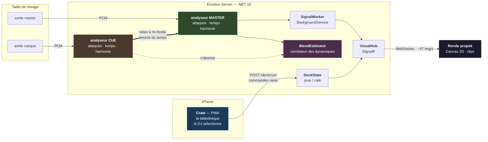
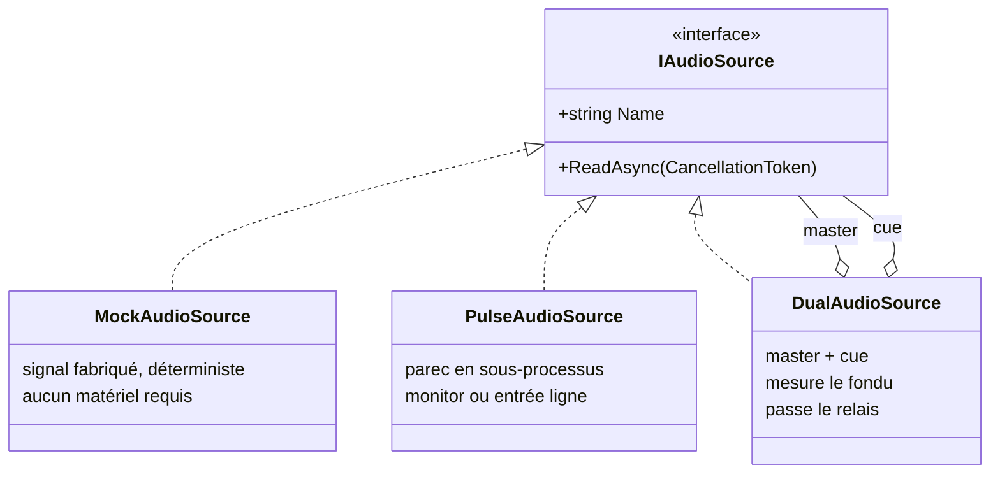
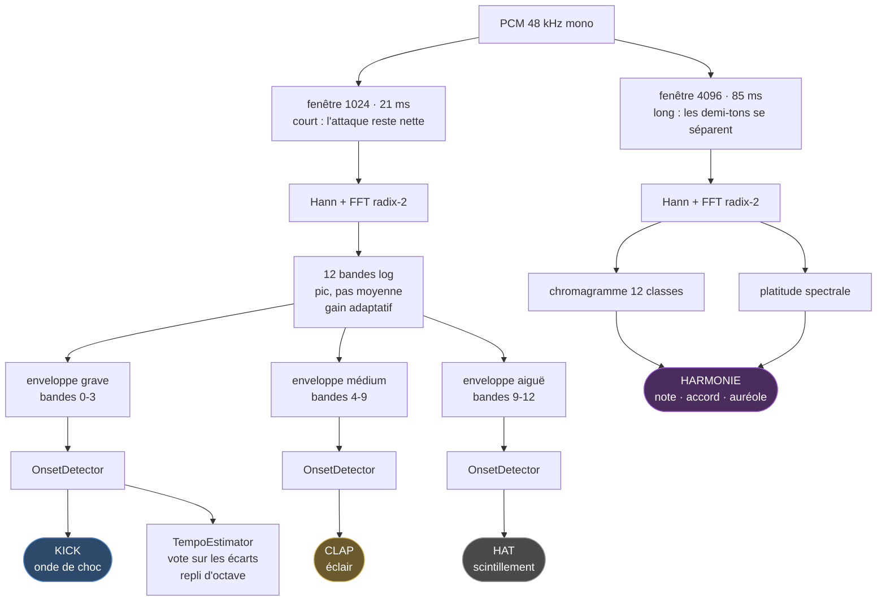
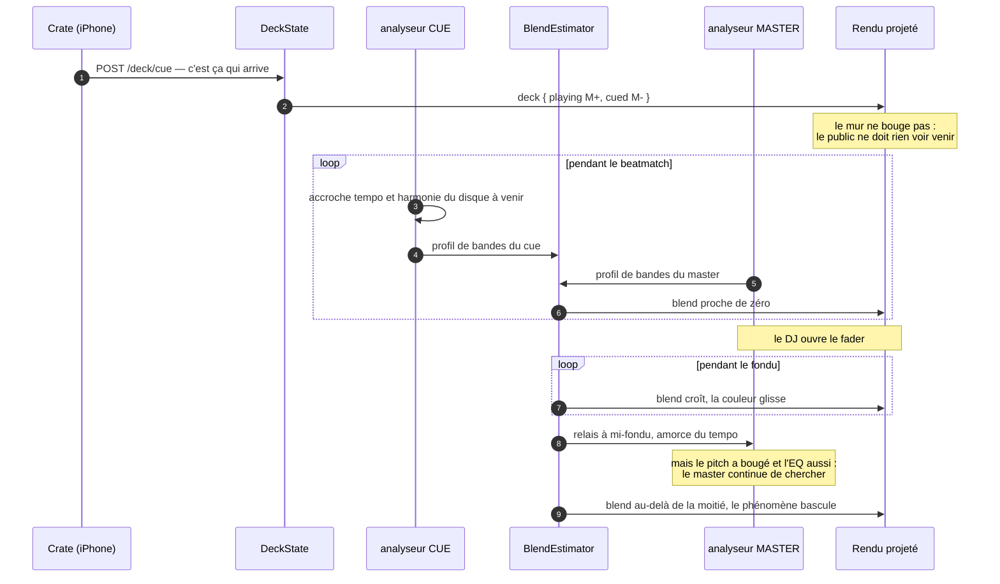
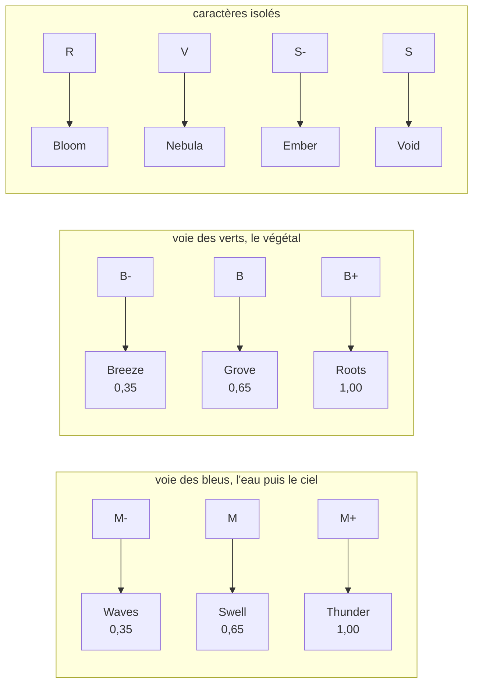

# Emotion Emulator

**Moteur de projection temps réel pour un set de vinyles.**
Aux platines, le DJ pose une face ; le rétroprojecteur en donne le phénomène — des
vagues sur un `M-`, un orage sur un `M+` — animé par le son qui sort réellement des
enceintes.

<table>
<tr>
<td width="50%"><br>
<sub><b>Waves</b> · famille <code>M-</code> · le ressac porte, il ne frappe pas</sub></td>
<td width="50%"><br>
<sub><b>Thunder</b> · famille <code>M+</code> · l'éclair part sur le clap, pas sur le kick</sub></td>
</tr>
</table>

Compagnon de [crate](https://github.com/LiquidSnake0/crate), la base de données du bac
de disques. Les deux se parlent par HTTP, ils ne fusionnent pas.

`.NET 10` · `ASP.NET Core` · `SignalR` · `Canvas 2D` · `PulseAudio` · `xUnit` ·
**48 tests** · **zéro dépendance tierce dans le cœur**

---

## Le problème

Un visualiseur audio ne connaît que le son. Il produit donc la même chose pour tout :
des barres qui montent et descendent. Il ignore qu'un morceau est mélancolique ou
massif, parce que cette information n'est nulle part dans le signal.

À l'inverse, un système qui ne connaîtrait que la fiche du morceau serait figé. Car un
vinyle **se joue à vitesse variable** : le DJ pitche au fader, ±8 % en usage courant et
jusqu'à ±16 %. Un BPM enregistré en base est faux dès la première seconde.

> ### Le son donne le mouvement. La base donne le caractère.

| Donnée | Source | Pourquoi |
|---|---|---|
| Attaques, énergie, 12 bandes | le **signal** | seule vérité du rythme, insensible au pitch |
| Tempo, hauteurs | le **signal**, dérivés | jamais nécessaires, jamais lus dans une fiche |
| Famille, Camelot, pochette | la **base** | plus fiable qu'une détection, et stable pendant un fondu |

Le dernier point va contre l'intuition « détectons tout », et mérite d'être défendu.
Estimer une tonalité en temps réel sur un mix est peu fiable en général et **impossible
pendant une transition** : deux disques superposés produisent un accord qui n'existe dans
aucun des deux. La saisie manuelle est ici plus juste que l'algorithme.

**Validation croisée obtenue en écoute réelle** — deux analyses indépendantes, l'une
lisant le bac et l'autre écoutant le vinyle, tombent d'accord :

| Mesure | Résultat | Fiche |
|---|---|---|
| Écart médian du kick | 683 ms → **87,8 BPM** | 87 BPM |
| Classes de hauteur dominantes | sol · si · fa# · la | `9A` = **mi mineur** |

Les quatre notes trouvées appartiennent toutes à mi mineur. Le système n'a jamais lu la
fiche.

---

## Architecture



### Deux canaux, et ce n'est pas un doublon

Pourquoi les commandes passent-elles par **HTTP** alors qu'une connexion **SignalR** est
déjà ouverte ? Parce que ce sont deux besoins opposés, et les mélanger dégraderait les
deux :

| | Commande `/deck/cue` | Événement `frame` |
|---|---|---|
| Fréquence | quelques dizaines par set | ~47 par seconde |
| Réponse attendue | oui, l'état résultant | aucune |
| Perte tolérable | **non** | **oui** — la suivante arrive dans 21 ms |
| Ordre | strict | sans importance |

Conséquence pratique décisive : **Crate n'embarque aucun client temps réel**. Un `fetch`
suffit pour commander, la PWA reste légère, et le même appel se teste en une ligne de
`curl` depuis les platines.

C'est une séparation commande/événement au sens du découpage des responsabilités.
Ce **n'est pas du CQRS** au sens strict, et le prétendre serait malhonnête : il n'y a ni
modèle de lecture distinct, ni magasin séparé, ni projection asynchrone. L'état tient
dans un enregistrement immuable de quelques champs. Du CQRS ici ajouterait de la
cérémonie sans résoudre le moindre problème réel — la question n'est pas de savoir si le
motif est prestigieux, mais s'il paie son coût.

### Ports et adaptateurs, sur la seule frontière qui bouge

`IAudioSource` est **la seule abstraction du projet**, placée exactement là où
l'incertitude est maximale : d'où vient le son.

```csharp
public interface IAudioSource
{
    string Name { get; }
    IAsyncEnumerable<VisualFrame> ReadAsync(CancellationToken ct);
}
```



`IAsyncEnumerable` plutôt qu'un événement : le flux est **tiré**, pas poussé. Un
consommateur lent ne noie donc pas le producteur, et l'annulation coopérative arrête
proprement le sous-processus par le `finally` de l'itérateur.

**Le mock n'est pas un échafaudage jetable.** Il sert à deux choses qui survivront au
branchement de la table : construire et régler tout le rendu sans matériel, et **rejouer
une séquence à l'identique** — à graine égale, le signal est le même à la milliseconde
près, ce qui permet de comparer deux versions d'un visuel sur exactement le même passage
au lieu de juger à l'œil sur deux écoutes différentes.

Le jour de la vraie table, **une seule ligne change** dans `Program.cs`.

### Le sous-processus assumé

`PulseAudioSource` lance `parec` et lit du PCM `s16le` sur sa sortie standard, plutôt
qu'une liaison native. Compromis explicite — coût : un processus fils et une dépendance
à un binaire système ; gain : aucune bibliothèque native à compiler par plateforme, et
**le même adaptateur pour les deux usages**, seul le périphérique change :

```
alsa_output.….monitor       ce qui sort des haut-parleurs   → essai sans matériel
alsa_input.…analog-stereo    l'entrée ligne                  → table branchée
```

Ce n'est pas un contournement : c'est ce qui a permis de valider la chaîne complète sur
un portable, sans rien acheter.

> **Piège rencontré, et il vaut d'être connu.** `RedirectStandardError = true` sans
> jamais lire stderr : quand le tampon du tube se remplit, `parec` se bloque en écriture
> et **cesse d'alimenter stdout**. Le flux s'arrête sans la moindre erreur. Il est
> désormais drainé en continu, et `parec` est relancé s'il meurt — un set ne doit pas
> mourir parce qu'un câble a bougé.

---

## La chaîne de traitement du signal



### HPSS : séparer avant d'analyser

Dans un spectrogramme, les deux familles de sons laissent des traces **perpendiculaires** :

```
fréquence
   ^
   |   |        |         une percussion : trace VERTICALE
   |   |        |         large en fréquence, brève dans le temps
   |───────────────────   une note tenue : trace HORIZONTALE
   |   |        |         étroite en fréquence, longue dans le temps
   +─────────────────> temps
```

D'où la méthode : une **médiane le long du temps**, à fréquence fixe, conserve ce qui
dure et efface ce qui passe — c'est l'harmonique. Une **médiane le long des fréquences**,
à instant fixe, conserve ce qui s'étale et efface ce qui est étroit — c'est le percussif.

La médiane et non la moyenne, parce qu'elle est insensible aux valeurs extrêmes : c'est
précisément ce qu'on veut, puisque l'autre composante **est** la valeur extrême dont il
faut se débarrasser.

Les deux chaînes en profitent : les attaques travaillent sur le percussif seul, le
chromagramme sur l'harmonique seul. Masques de **Wiener** plutôt qu'un choix binaire —
un masque binaire attribuerait chaque bin entier à l'une des composantes et laisserait
des trous nets dans le spectre ; les masques doux répartissent proportionnellement au
carré, et leur somme vaut exactement l'original (un test le vérifie).

**Mesure sur `instamata`, même morceau, séparation coupée puis active :**

| | sans HPSS | avec HPSS | cible |
|---|---|---|---|
| BPM du kick | 112,1 | **90,6** | 87 |
| erreur | +29 % | **+4 %** | — |
| régularité (écart-type des écarts) | 187 ms | **156 ms** | plus bas = mieux |

Le piano remplissait les médiums de flux en permanence et brouillait la détection ; les
percussions salissaient en retour le chromagramme. Séparer nettoie les deux d'un coup,
au lieu d'ajouter une correction à chacune.

**Le prix est une latence de 64 ms**, et elle est structurelle : pour savoir si un bin
durait, il faut avoir vu la suite. Elle est annoncée par `LatencyFrames` plutôt que
subie, et la séparation se coupe par configuration — `Signal__Separate=false` — pour
pouvoir comparer avec et sans sur le même morceau. C'est ainsi que les chiffres
ci-dessus ont été obtenus.

**Fenêtre de Hann.** Sans elle, une note qui ne tombe pas exactement sur un bin fuit sur
tout le spectre et les bandes graves se remplissent de bruit d'aigu.

**FFT écrite à la main.** Le projet a besoin du module du spectre d'une fenêtre, 47 fois
par seconde. Une dépendance de calcul scientifique pour cela coûterait plus en surface
qu'elle ne rapporte. 60 lignes, un test qui vérifie qu'une sinusoïde pure produit son pic
au bon bin.

**Bandes logarithmiques**, 30 Hz à 16 kHz. L'oreille entend le *rapport* entre deux
fréquences, pas leur différence : douze bandes linéaires donneraient onze bandes d'aigus
et une seule pour tout le grave. On prend le **pic** de chaque bande, jamais la moyenne —
sur une bande large, une moyenne noie la pointe, or c'est la pointe qui se voit à l'écran.

**Trois conditions pour une attaque**, et il faut les trois.

1. **Franchir un seuil adaptatif.** Chaque valeur est comparée à la moyenne des ~0,9
   dernières secondes, pas à une constante. Un seuil fixe marcherait sur un morceau et
   raterait le suivant, puisque le crate va d'un ambient feutré à des batteries sèches.
2. **Être un maximum local.** C'est la condition qui manquait, et son absence se
   mesurait : l'écart médian tombait à 510 ms quand l'écart minimal imposé valait 426 ms.
   *Quand les deux se rejoignent, le détecteur ne détecte plus rien* — il déclenche dès
   qu'il en a le droit, et c'est la contrainte qui sert de métronome. Prix : 64 ms de
   retard, sous le seuil de perception d'un décalage son/image.
3. **Respecter un écart minimal**, pour ne pas compter deux fois la même frappe à cause
   de sa résonance.

**Tempo par vote, jamais par moyenne.** Les écarts entre attaques sont arrondis à 10 ms
et votent. Une moyenne serait détruite par une seule attaque manquée, qui doublerait un
écart ; un vote laisse les erreurs se disperser pendant que la bonne valeur s'accumule.
Il faut qu'un tiers des écarts soient d'accord — **en dessous, on préfère ne rien dire**.
`Bpm` est `float?`, et le renderer sait tourner sans lui.

**Repli d'octave.** 87 et 174 BPM produisent les mêmes intervalles si une frappe sur deux
est plus marquée. On replie vers 70–110, une plage qui décrit **le répertoire** et non un
morceau : l'ambiguïté est levée sans jamais lire une fiche.

**L'harmonie a besoin d'une fenêtre quatre fois plus longue**, et c'est le point clé. Les
deux analyses ont des besoins opposés : une attaque demande une fenêtre courte pour
rester nette dans le temps, une note demande une fenêtre longue pour être précise en
fréquence. C'est la **limite de Gabor**, pas un défaut d'implémentation. À 1024 points un
bin vaut 47 Hz et tout l'aigu du piano s'écrase ; à 4096, il vaut 11,7 Hz et les
demi-tons se séparent au-dessus de 200 Hz.

---

## La transition : une mesure, pas un bouton

Une transition de DJ n'est pas un instant, c'est un geste — le fader monte pendant huit
ou seize mesures. Le visuel doit **suivre ce geste**, pas l'annoncer.



`BlendEstimator` corrèle la **dynamique** des deux entrées pour savoir quelle part du
préparé est déjà passée dans le mélange. On ne mesure pas la position du fader mais son
effet : à mi-course sur un morceau discret, il ne se passe pas la même chose qu'à
mi-course sur un morceau massif.

> **Le centrage se fait bande par bande, et c'est le point délicat.** Une première
> version centrait sur la moyenne globale : la mesure saturait à 1 **fader fermé**. Ce
> n'était pas un bug mais une propriété de la musique — deux morceaux quelconques ont
> tous deux plus d'énergie dans les graves, donc leurs profils se ressemblent par
> construction, et cette ressemblance n'apprend rien. En retranchant la moyenne propre à
> chaque bande, il ne reste que la dynamique : où ça monte, où ça descend, à quel moment.
> C'est elle qui porte le rythme, donc qui identifie un disque dans un mélange.

**La relation n'est pas linéaire, et il ne faut pas la rendre linéaire.** À fader
mi-course, la mesure vaut déjà ~0,8 : c'est correct, parce qu'à mi-course le nouveau
morceau domine déjà la perception. Le visuel suit l'effet sur l'oreille, pas la position
mécanique du potentiomètre.

**Le relais amorce, il ne verrouille pas.** À mi-fondu le master reprend le tempo du cue
comme point de départ — un estimateur parti de rien met une à deux secondes à accrocher,
et ces deux secondes tomberaient en plein milieu du passage le plus visible du set. Mais
le master a bien à découvrir : **le pitch a bougé pendant le beatmatch**, c'est même le
but du geste, et l'EQ de la table modifie le spectre entre le casque et la sortie.
`Adopt` n'amorce donc qu'un tiers de la mémoire du vote. Un test le vérifie : cue à 87,
disque réellement pitché à 94, le master converge vers 94.

---

## Le modèle des platines

Une contrainte de métier qu'aucune considération technique ne peut arbitrer : le DJ cale
son prochain disque **au casque**, pendant que le précédent joue encore. Si la projection
changeait au moment où il sélectionne, le public verrait le beatmatch commencer —
c'est-à-dire la coulisse.

```csharp
public sealed record Deck(TrackContext Playing, TrackContext? Cued)
{
    public Deck Cue(TrackContext next) => this with { Cued = next };
    public Deck Take() => Cued is null ? this : new Deck(Cued, null);
    public Deck Drop() => this with { Cued = null };
}
```

| Geste | Endpoint | Effet sur le mur |
|---|---|---|
| Poser une face | `POST /deck/play` | bascule |
| Caler au casque | `POST /deck/cue` | **aucun** |
| Transition faite | `POST /deck/take` | bascule |
| Renoncer | `POST /deck/drop` | aucun |

Trois détails défensifs, chacun couvert par un test :

- `Take()` sans rien de calé **ne coupe pas la projection**. Un geste de trop en plein
  set ne doit pas éteindre le mur.
- Une famille inconnue retombe sur `Rest`, jamais sur une exception. Un crate en cours de
  correction contient des familles vides.
- `Deck.Empty` projette un repos : au lancement, avant le premier disque, le mur montre
  quelque chose.

---

## Du caractère au phénomène

`Scene.ForFamily` traduit une famille du bac en phénomène projeté.



**Cette table est une proposition, pas une règle du domaine.** Elle est tirée de la forme
de la palette — deux voies parallèles, du clair au foncé, plus quatre familles isolées —
et non d'une intention écrite. Elle se corrige famille par famille, à l'écoute.

**L'intensité ne choisit pas le visuel : elle décide s'il part.** Sur un `M-` la moitié
des occasions passe sans rien, ce qui laisse respirer ; sur un `M+` presque tout se
déclenche. La montée d'un set se voit donc à la densité de l'écran autant qu'à sa
couleur.

Les enums partent par leur **nom**, jamais leur rang : un jour une valeur sera insérée au
milieu, et un renderer qui compare des entiers changerait de phénomène sans que rien ne
le signale.

---

## L'écran de réglage


**Touche `D`. On ne règle pas ce qu'on ne voit pas.**

Il montre l'enveloppe qui décide vraiment — celle du kick — le seuil adaptatif en vert,
chaque attaque en trait vertical coloré par registre, les douze bandes, et l'écart médian
converti en BPM.

C'est l'outil qui a permis de passer de **341 BPM implicites à 87,8 mesurés**, en quatre
diagnostics successifs :

| Constat à l'écran | Cause | Correction |
|---|---|---|
| 4 attaques par temps | flux calculé sur tout le spectre, saturé par le souffle et le crépitement de vinyle | flux limité au registre du kick |
| écart médian ≈ écart minimal | pas de condition de maximum local | exiger un sommet, pas un franchissement |
| `kick 80` et `clap 81` aux mêmes instants | tranches de registre qui se chevauchaient | tranches disjointes + dominance du médium |
| courbe en dents de scie | flux brut d'une fenêtre à l'autre | moyenne mobile à deux termes |

> Une version affichait le flux **global** alors que les attaques venaient des enveloppes
> **par registre**. Un outil de réglage qui montre autre chose que ce qui décide est pire
> qu'aucun outil.

---

## Faire tourner

```sh
# Signal fabriqué, aucun matériel requis
dotnet run --project src/Emotion.Server

# Écoute réelle : ce qui sort des haut-parleurs
Signal__Source=pulse \
Signal__Device=$(pactl list short sources | grep monitor | head -1 | cut -f2) \
dotnet run --project src/Emotion.Server

# Avec la sortie casque de la table sur l'entrée ligne
Signal__CueDevice=alsa_input.pci-0000_00_1f.3.analog-stereo \
dotnet run --project src/Emotion.Server
```

`http://localhost:5299` · `F` plein écran · `D` diagnostic · `H` masque le bandeau —
il ne doit jamais finir sur le mur.

```sh
curl -X POST localhost:5299/deck/play -H 'Content-Type: application/json' -d '{
  "title":"instamata","disc":"haircuts for men","side":"",
  "camelot":"9A","family":"M+","colorHex":"#154360","coverUrl":null}'

curl -X POST localhost:5299/deck/cue  -H 'Content-Type: application/json' -d '{
  "title":"Dreamcast Nostalgia","disc":"macintosh plus","side":"B",
  "camelot":"8A","family":"M-","colorHex":"#7FB3D5","coverUrl":null}'

curl -X POST localhost:5299/deck/take
```

```sh
dotnet test        # 48 tests
```

### Les images et les clips

Le dépôt ne contient **aucune œuvre**. `assets/manifest.json` est versionné, les fichiers
qu'il décrit ne le sont pas — des vidéos dans un dépôt git le rendent inutilisable en
trois commits, et du matériel sous copyright dans un dépôt public devient une pièce à
charge plutôt qu'une démonstration.

```json
{ "file": "clips/pluie.webm", "kinds": ["Thunder", "Swell"],
  "weight": 3, "blend": "screen", "every": 4 }
```

Le déclenchement suit les **attaques**, jamais un minuteur : un clip parti sur le clap
reste calé même si le disque est pitché. Sans dossier d'assets, la bibliothèque reste
inerte et la géométrie tourne seule.

---

## Structure

| Projet | Rôle | Dépendances |
|---|---|---|
| `Emotion.Signal` | modèle, analyse, sources | **aucune** — ni web, ni paquet tiers |
| `Emotion.Server` | hub, endpoints, rendu servi en statique | ASP.NET Core, SignalR |
| `Emotion.Signal.Tests` | 48 tests | xUnit |

Le cœur ne dépend de rien : la FFT, la détection d'attaques, l'estimation de tempo,
l'analyse harmonique, la mesure de fondu et le modèle des platines se testent **sans
serveur, sans carte son et sans navigateur**.

---

## Ce qui reste

- **Signature par événement** — centroïde spectral, largeur de bande et temps de
  décroissance suffisent à ranger un son dans une famille générique sans avoir à le
  nommer.
- **Structure du morceau** — densité et énergie sur fenêtre glissante, détection de
  rupture pour repérer les sections.
- **Geler le tempo pendant un fondu**, où les attaques de deux disques se mélangent.
- **Les huit phénomènes non dessinés.**
- **Le mapping proprement dit** — déformation par homographie pour caler l'image sur la
  surface physique projetée.
- **Passage à WebGL** quand il y aura une carte graphique en face.
