# Emotion Emulator

**Moteur de projection temps réel pour un set de vinyles.**
Aux platines, le DJ pose une face ; le rétroprojecteur en donne le phénomène — des
vagues sur un `M-`, un orage sur un `M+` — animé par le son qui sort réellement des
enceintes.

<table>
<tr>
<td width="50%">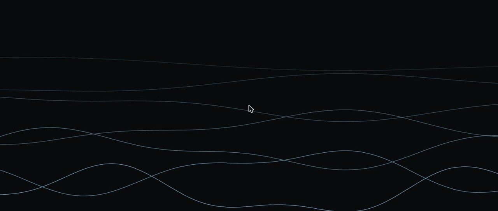<br>
<sub><b>Waves</b> · famille <code>M-</code> · le ressac porte, il ne frappe pas</sub></td>
<td width="50%">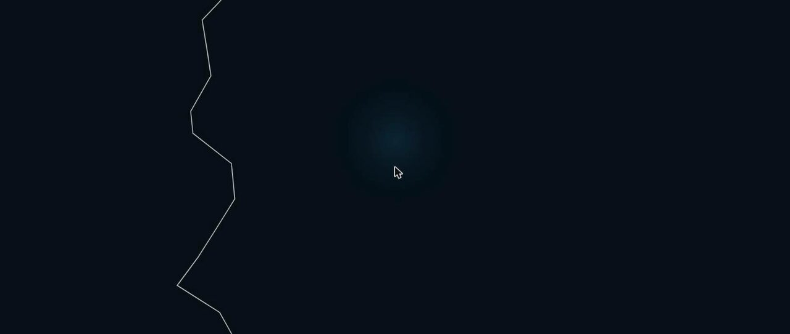<br>
<sub><b>Thunder</b> · famille <code>M+</code> · l'éclair part sur le clap, pas sur le kick</sub></td>
</tr>
</table>

Compagnon de [crate](https://github.com/LiquidSnake0/crate), la base de données du bac
de disques. Les deux se parlent par HTTP, ils ne fusionnent pas.

`.NET 10` · `ASP.NET Core` · `SignalR` · `Canvas 2D` · `PulseAudio` · `xUnit` ·
**128 tests** · **zéro dépendance tierce dans le cœur** · **48 ms du son au paquet**

---

## Voir tourner

Le mur en marche, et l'écran de réglage qui montre ce que le système sait au même instant.
Rien n'est décoratif : chaque forme est commandée par une grandeur mesurée.

Le rendu se lance sans matériel — `dotnet run --project src/Emotion.Server` fabrique un
signal et anime la scène, ce qui permet de régler le visuel sans table de mixage ni
platine. Voir [**Faire tourner**](#faire-tourner).

<table>
<tr>
<td width="52%">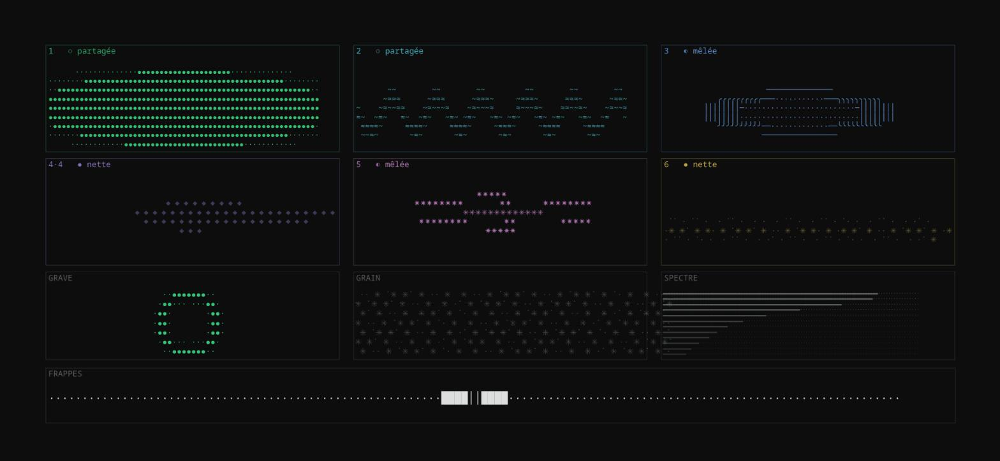<br>
<sub><b>Le mur</b> · six sources séparées, une forme chacune ; le verdict de chaque bande
dans son titre</sub></td>
<td width="48%">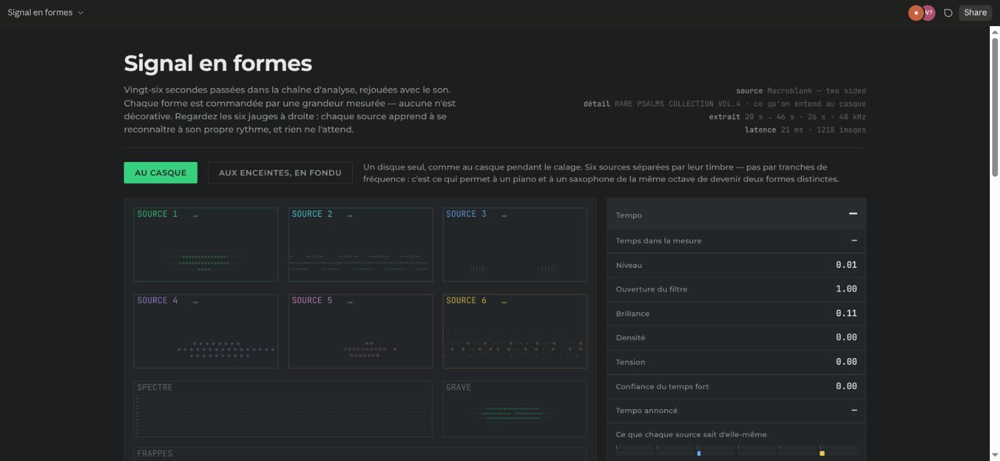<br>
<sub><b>La démo</b> · les mêmes images, avec le son et les grandeurs mesurées en
regard</sub></td>
</tr>
</table>

---

## Le problème

Un visualiseur audio ne connaît que le son. Il produit donc la même chose pour tout :
des barres qui montent et descendent. Il ignore qu'un morceau est mélancolique ou
massif, parce que cette information n'est nulle part dans le signal.

À l'inverse, un système qui ne connaîtrait que la fiche du morceau serait figé. Car un
vinyle **se joue à vitesse variable** : le DJ pitche au fader, ±8 % en usage courant et
jusqu'à ±16 %. Un BPM enregistré en base est faux dès la première seconde.

> ### Le son donne le mouvement. La base donne le caractère.

| Donnée | Source | Pourquoi |
|---|---|---|
| Attaques, énergie, 12 bandes | le **signal** | seule vérité du rythme, insensible au pitch |
| Tempo, hauteurs | le **signal**, dérivés | jamais nécessaires, jamais lus dans une fiche |
| Famille, Camelot, pochette | la **base** | plus fiable qu'une détection, et stable pendant un fondu |

Le dernier point va contre l'intuition « détectons tout », et mérite d'être défendu.
Estimer une tonalité en temps réel sur un mix est peu fiable en général et **impossible
pendant une transition** : deux disques superposés produisent un accord qui n'existe dans
aucun des deux. La saisie manuelle est ici plus juste que l'algorithme.

**Validation croisée obtenue en écoute réelle** — deux analyses indépendantes, l'une
lisant le bac et l'autre écoutant le vinyle, tombent d'accord :

| Mesure | Résultat | Fiche |
|---|---|---|
| Écart médian du kick | 683 ms → **87,8 BPM** | 87 BPM |
| Classes de hauteur dominantes | sol · si · fa# · la | `9A` = **mi mineur** |

Les quatre notes trouvées appartiennent toutes à mi mineur. Le système n'a jamais lu la
fiche.

---

## Architecture

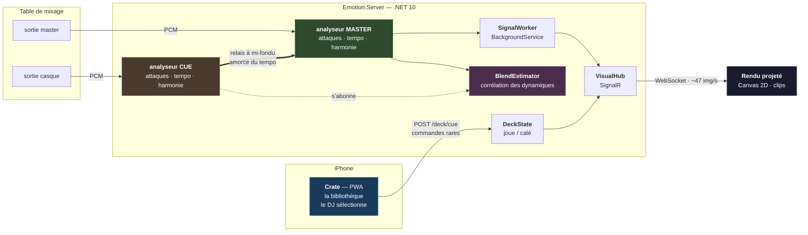

### Deux canaux, et ce n'est pas un doublon

Pourquoi les commandes passent-elles par **HTTP** alors qu'une connexion **SignalR** est
déjà ouverte ? Parce que ce sont deux besoins opposés, et les mélanger dégraderait les
deux :

| | Commande `/deck/cue` | Événement `frame` |
|---|---|---|
| Fréquence | quelques dizaines par set | ~47 par seconde |
| Réponse attendue | oui, l'état résultant | aucune |
| Perte tolérable | **non** | **oui** — la suivante arrive dans 21 ms |
| Ordre | strict | sans importance |

Conséquence pratique décisive : **Crate n'embarque aucun client temps réel**. Un `fetch`
suffit pour commander, la PWA reste légère, et le même appel se teste en une ligne de
`curl` depuis les platines.

C'est une séparation commande/événement au sens du découpage des responsabilités.
Ce **n'est pas du CQRS** au sens strict, et le prétendre serait malhonnête : il n'y a ni
modèle de lecture distinct, ni magasin séparé, ni projection asynchrone. L'état tient
dans un enregistrement immuable de quelques champs. Du CQRS ici ajouterait de la
cérémonie sans résoudre le moindre problème réel — la question n'est pas de savoir si le
motif est prestigieux, mais s'il paie son coût.

### Ports et adaptateurs, sur la seule frontière qui bouge

`IAudioSource` est **la seule abstraction du projet**, placée exactement là où
l'incertitude est maximale : d'où vient le son.

```csharp
public interface IAudioSource
{
    string Name { get; }
    IAsyncEnumerable<VisualFrame> ReadAsync(CancellationToken ct);
}
```

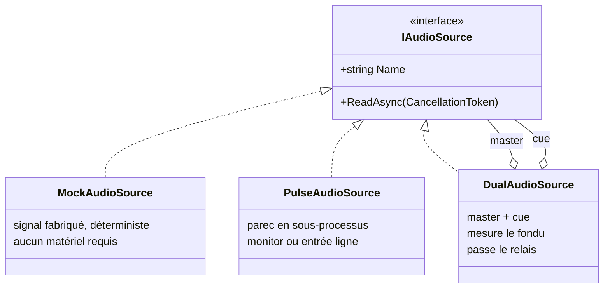

`IAsyncEnumerable` plutôt qu'un événement : le flux est **tiré**, pas poussé. Un
consommateur lent ne noie donc pas le producteur, et l'annulation coopérative arrête
proprement le sous-processus par le `finally` de l'itérateur.

**Le mock n'est pas un échafaudage jetable.** Il sert à deux choses qui survivront au
branchement de la table : construire et régler tout le rendu sans matériel, et **rejouer
une séquence à l'identique** — à graine égale, le signal est le même à la milliseconde
près, ce qui permet de comparer deux versions d'un visuel sur exactement le même passage
au lieu de juger à l'œil sur deux écoutes différentes.

Le jour de la vraie table, **une seule ligne change** dans `Program.cs`.

### Le sous-processus assumé

`PulseAudioSource` lance `parec` et lit du PCM `s16le` sur sa sortie standard, plutôt
qu'une liaison native. Compromis explicite — coût : un processus fils et une dépendance
à un binaire système ; gain : aucune bibliothèque native à compiler par plateforme, et
**le même adaptateur pour les deux usages**, seul le périphérique change :

```
alsa_output.….monitor       ce qui sort des haut-parleurs   → essai sans matériel
alsa_input.…analog-stereo    l'entrée ligne                  → table branchée
```

Ce n'est pas un contournement : c'est ce qui a permis de valider la chaîne complète sur
un portable, sans rien acheter.

> **Piège rencontré, et il vaut d'être connu.** `RedirectStandardError = true` sans
> jamais lire stderr : quand le tampon du tube se remplit, `parec` se bloque en écriture
> et **cesse d'alimenter stdout**. Le flux s'arrête sans la moindre erreur. Il est
> désormais drainé en continu, et `parec` est relancé s'il meurt — un set ne doit pas
> mourir parce qu'un câble a bougé.

---

## La chaîne de traitement du signal


### HPSS : séparer avant d'analyser

Dans un spectrogramme, les deux familles de sons laissent des traces **perpendiculaires** :

```
fréquence
   ^
   |   |        |         une percussion : trace VERTICALE
   |   |        |         large en fréquence, brève dans le temps
   |───────────────────   une note tenue : trace HORIZONTALE
   |   |        |         étroite en fréquence, longue dans le temps
   +─────────────────> temps
```

D'où la méthode : une **médiane le long du temps**, à fréquence fixe, conserve ce qui
dure et efface ce qui passe — c'est l'harmonique. Une **médiane le long des fréquences**,
à instant fixe, conserve ce qui s'étale et efface ce qui est étroit — c'est le percussif.

La médiane et non la moyenne, parce qu'elle est insensible aux valeurs extrêmes : c'est
précisément ce qu'on veut, puisque l'autre composante **est** la valeur extrême dont il
faut se débarrasser.

Les deux chaînes en profitent : les attaques travaillent sur le percussif seul, le
chromagramme sur l'harmonique seul. Masques de **Wiener** plutôt qu'un choix binaire —
un masque binaire attribuerait chaque bin entier à l'une des composantes et laisserait
des trous nets dans le spectre ; les masques doux répartissent proportionnellement au
carré, et leur somme vaut exactement l'original (un test le vérifie).

**Mesure sur `instamata`, même morceau, séparation coupée puis active :**

| | sans HPSS | avec HPSS | cible |
|---|---|---|---|
| BPM du kick | 112,1 | **90,6** | 87 |
| erreur | +29 % | **+4 %** | — |
| régularité (écart-type des écarts) | 187 ms | **156 ms** | plus bas = mieux |

Le piano remplissait les médiums de flux en permanence et brouillait la détection ; les
percussions salissaient en retour le chromagramme. Séparer nettoie les deux d'un coup,
au lieu d'ajouter une correction à chacune.

**Le prix est une latence**, et elle est structurelle : pour savoir si un bin durait, il
faut avoir vu la suite. Elle est annoncée par `LatencyFrames` plutôt que subie, et la
séparation se coupe par configuration — `Signal__Separate=false` — pour pouvoir comparer
avec et sans sur le même morceau.

### Le retard, ou la leçon la plus utile du projet

Deux étages retardent la détection, et j'avais réglé chacun sans jamais additionner leur
total :

| Étage | Version initiale | Corrigée |
|---|---|---|
| HPSS — voir si un bin *durait* demande de voir la suite | 3 fenêtres = 64 ms | 1 fenêtre = 21 ms |
| Détecteur — un sommet ne se reconnaît qu'après | 3 fenêtres = 64 ms | 1 fenêtre = 21 ms |
| **Total** | **128 ms** | **43 ms** |

L'œil décroche vers 40 ms : un éclair arrivant un huitième de seconde après le clap ne
paraît plus lié à lui du tout. Le symptôme était formulé ainsi par l'utilisateur — *« l'orbe
au milieu est le seul truc bien calé, les éclairs c'est trop chelou »* — et il avait
entièrement raison. L'orbe suit les graves **en continu**, sans aucune détection : il ne
peut pas être en retard. Tout ce qui passe par une décision l'était.

**Et le raccourcissement a amélioré la détection au lieu de la dégrader :**

| | 128 ms de retard | 43 ms |
|---|---|---|
| BPM du kick | 90,6 | **87,6** |
| Écart médian | 662 ms | **685 ms** |
| *Cible* | *87 BPM · 690 ms* | |

Des fenêtres plus courtes préservent mieux la netteté temporelle de l'attaque. Le
filtrage supplémentaire qu'on payait en désynchronisation ne rapportait rien.

**Puis la séparation harmonique a été coupée par défaut, et le retard est tombé à 21 ms.**
Sur ce répertoire elle coûtait plus qu'elle ne rapportait : mesurée sur un morceau à
barber beats, la corrélation d'autocorrélation du tempo passait de 0,226 sans elle à 0,066
avec — elle effaçait la pulsation d'un genre qui étouffe ses kicks. Elle reste activable
par configuration, pour comparer.

Le retard est désormais **affiché** — `retard 21 ms` dans le nom de la source, en rouge
au-delà de 40 dans l'écran de calage. C'est une grandeur qu'on regarde, pas qu'on subit.

### Le budget complet, du son au paquet

> **48 ms séparent le son du paquet qui part au GPU**, dont 42,6 sont incompressibles et
> 2,2 seulement sont du calcul.

| Étage | Coût | Nature |
|---|---|---|
| capture PulseAudio | **3,3 ms** | subi — mais trois fois moins cher que supposé |
| fenêtre d'analyse | **21,3 ms** | incompressible — il faut l'avoir entendue en entier |
| anticipation du sommet | **21,3 ms** | incompressible — un pic ne se voit qu'après |
| calcul | **2,2 ms** | maîtrisé — 8,8 % du pas de 21,3 ms |
| anneau partagé | **1,5 µs** | maîtrisé — mémoire partagée, sans verrou |

**Le calcul n'est pas le problème.** Il occupe moins d'un dixième du budget ; le reste est
de l'attente pure. Optimiser ici reviendrait à courir plus vite dans une file d'attente —
c'est pourquoi la réponse retenue n'est pas d'aller plus vite mais de **ne plus attendre**,
en prédisant le kick au lieu de le constater.

**Deux chiffres ont été corrigés par la mesure, et dans le bon sens.** La capture était
portée à 20 ms au budget : c'est la valeur *demandée* à `parec`, pas celle obtenue — le
serveur rend 4,4 ms de tampon réel pour 20 demandées, 3,3 pour 5. Et à rebours de
l'intuition, **un tampon court rend le flux plus régulier** : la gigue d'arrivée des blocs
tombe de 3,1 ms à 0,9 en passant de 20 à 5, sans un seul bloc en retard, machine chargée
sur ses huit cœurs et serveur en marche. `EMOTION_CAPTURE_MS` permet de comparer.

### Ce qu'il reste pour l'unité de rendu

Le cas est celui d'une image qui suit un son — l'asynchronie *« vidéo en retard »*, la
mieux tolérée des deux.

| Référence | Seuil | Marge restante |
|---|---|---|
| **Laboratoire — imperceptible** | **20 ms** | **−28 ms** ← la cible |
| [EBU R37](https://tech.ebu.ch/publications/r037) — norme de diffusion | 40 ms | −8 ms |
| [ITU-R BT.1359-1](https://www.itu.int/rec/R-REC-BT.1359) — détectable | 45 ms | −3 ms |
| ITU-R BT.1359-1 — inacceptable | 90 ms | +42 ms |

**La cible est 20 ms**, et non 40. Les normes de diffusion sont écrites pour de la parole
et des plans larges ; ici l'événement est une frappe sèche que le spectateur cherche
activement à voir tomber avec ce qu'il entend, et c'est le cas le plus défavorable —
la détection est possible dès 20 ms sur un transitoire net.

Un vidéoprojecteur consomme 16 à 33 ms selon son traitement d'image ; un modèle de mapping
en mode faible latence descend vers 16, ce qui laisse **une vingtaine de millisecondes**
pour le rendu aller-retour.

**Sauf pour le kick, et c'est ce qui rend la cible atteignable.** L'horloge à verrouillage
de phase ne réagit pas à la frappe, elle la prévoit, et part donc **en avance** — 30 ms
aujourd'hui. Sur cet événement, le retard perçu tombe à `48 − 30 = 18 ms`, **sous le seuil
d'imperceptibilité**.

Cette avance n'est pas bornée par la perception mais par la **prévisibilité du tempo** : à
87 BPM un temps dure 690 ms, donc 30 ms représentent 4 % d'un temps, et 60 ms en
représenteraient 9 %. Tant que le tempo tient à 1 % près, l'avance peut absorber le GPU et
le projecteur en plus — il suffit de l'augmenter d'autant, ce que `?lead=54` permet sans
toucher au code. **Le budget prédictif est large ; c'est la stabilité du plateau qui le
limite, pas l'œil.**

> **Le calcul, avec une unité de rendu et un vidéoprojecteur :**
> `48 ms` d'analyse `+ 10` de rendu `+ 16` de projecteur `= 74 ms` de chaîne.
> Pour viser les 20 ms imperceptibles, l'avance doit valoir **54 ms** — soit 7,8 % d'un
> temps à 87 BPM. L'horloge en accepte jusqu'à 40 %. C'est le défaut ; `?lead=30` remet le
> réglage d'un écran d'ordinateur, où la chaîne est plus courte d'une vingtaine de
> millisecondes et où 54 ferait partir le visuel trop tôt.

**Deux défauts trouvés en vérifiant ce mécanisme, et ils annulaient tous deux l'avance.**
Le paramètre était reçu par l'horloge puis **multiplié par zéro** : documenté, transmis, et
sans effet. Et une fois corrigé, l'avance obtenue restait courte — 23 ms pour 30 demandées —
parce qu'on ne peut tirer qu'aux réveils de la boucle de rendu, soit une fois toutes les
16,7 ms à 60 images par seconde : on rate donc en moyenne une demi-image. L'horloge
anticipe désormais cette demi-image, et rend 28,7 ms pour 30 demandées, 60,2 pour 60.

Tout ce qui n'est pas périodique — clap irrégulier, voix, rupture — subit les 48 ms et ne
peut pas être avancé : prédire l'imprévisible inventerait des événements, ce qui est pire
qu'un visuel en retard.

**Une seule économie a été cherchée et rejetée.** Supprimer l'anticipation du sommet
retirerait 21,3 ms, la plus grosse disponible : les détections tombent alors de 1003 à 683
et le verrouillage de la grille de 85 % à 70 %. Or c'est ce verrouillage qui permet de
prédire — raccourcir casserait ce qui compense.

**Fenêtre de Hann.** Sans elle, une note qui ne tombe pas exactement sur un bin fuit sur
tout le spectre et les bandes graves se remplissent de bruit d'aigu.

**FFT écrite à la main.** Le projet a besoin du module du spectre d'une fenêtre, 47 fois
par seconde. Une dépendance de calcul scientifique pour cela coûterait plus en surface
qu'elle ne rapporte. 60 lignes, un test qui vérifie qu'une sinusoïde pure produit son pic
au bon bin.

**Bandes logarithmiques**, 30 Hz à 16 kHz. L'oreille entend le *rapport* entre deux
fréquences, pas leur différence : douze bandes linéaires donneraient onze bandes d'aigus
et une seule pour tout le grave. On prend le **pic** de chaque bande, jamais la moyenne —
sur une bande large, une moyenne noie la pointe, or c'est la pointe qui se voit à l'écran.

**Trois conditions pour une attaque**, et il faut les trois.

1. **Franchir un seuil adaptatif.** Chaque valeur est comparée à la moyenne des ~0,9
   dernières secondes, pas à une constante. Un seuil fixe marcherait sur un morceau et
   raterait le suivant, puisque le crate va d'un ambient feutré à des batteries sèches.
2. **Être un maximum local.** C'est la condition qui manquait, et son absence se
   mesurait : l'écart médian tombait à 510 ms quand l'écart minimal imposé valait 426 ms.
   *Quand les deux se rejoignent, le détecteur ne détecte plus rien* — il déclenche dès
   qu'il en a le droit, et c'est la contrainte qui sert de métronome. Prix : 64 ms de
   retard, sous le seuil de perception d'un décalage son/image.
3. **Respecter un écart minimal**, pour ne pas compter deux fois la même frappe à cause
   de sa résonance.

**Tempo par vote, jamais par moyenne.** Les écarts entre attaques sont arrondis à 10 ms
et votent. Une moyenne serait détruite par une seule attaque manquée, qui doublerait un
écart ; un vote laisse les erreurs se disperser pendant que la bonne valeur s'accumule.
Il faut qu'un tiers des écarts soient d'accord — **en dessous, on préfère ne rien dire**.
`Bpm` est `float?`, et le renderer sait tourner sans lui.

**Repli d'octave.** 87 et 174 BPM produisent les mêmes intervalles si une frappe sur deux
est plus marquée. On replie vers 70–110, une plage qui décrit **le répertoire** et non un
morceau : l'ambiguïté est levée sans jamais lire une fiche.

**L'harmonie a besoin d'une fenêtre quatre fois plus longue**, et c'est le point clé. Les
deux analyses ont des besoins opposés : une attaque demande une fenêtre courte pour
rester nette dans le temps, une note demande une fenêtre longue pour être précise en
fréquence. C'est la **limite de Gabor**, pas un défaut d'implémentation. À 1024 points un
bin vaut 47 Hz et tout l'aigu du piano s'écrase ; à 4096, il vaut 11,7 Hz et les
demi-tons se séparent au-dessus de 200 Hz.

---

## La transition : une mesure, pas un bouton

Une transition de DJ n'est pas un instant, c'est un geste — le fader monte pendant huit
ou seize mesures. Le visuel doit **suivre ce geste**, pas l'annoncer.

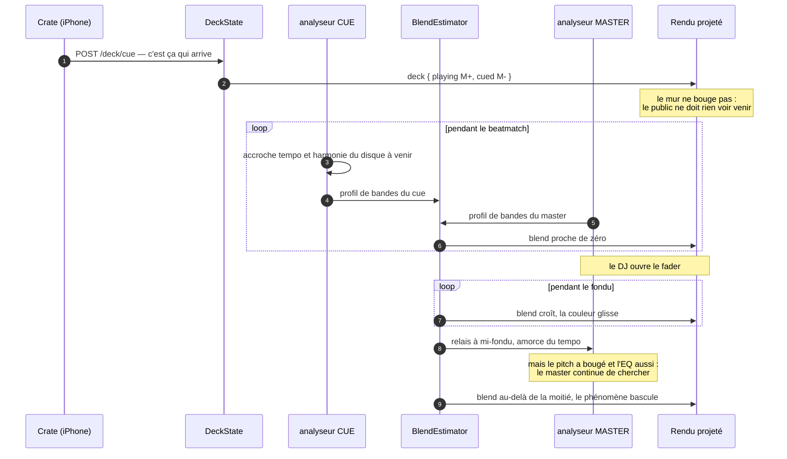

`BlendEstimator` corrèle la **dynamique** des deux entrées pour savoir quelle part du
préparé est déjà passée dans le mélange. On ne mesure pas la position du fader mais son
effet : à mi-course sur un morceau discret, il ne se passe pas la même chose qu'à
mi-course sur un morceau massif.

> **Le centrage se fait bande par bande, et c'est le point délicat.** Une première
> version centrait sur la moyenne globale : la mesure saturait à 1 **fader fermé**. Ce
> n'était pas un bug mais une propriété de la musique — deux morceaux quelconques ont
> tous deux plus d'énergie dans les graves, donc leurs profils se ressemblent par
> construction, et cette ressemblance n'apprend rien. En retranchant la moyenne propre à
> chaque bande, il ne reste que la dynamique : où ça monte, où ça descend, à quel moment.
> C'est elle qui porte le rythme, donc qui identifie un disque dans un mélange.

**La relation n'est pas linéaire, et il ne faut pas la rendre linéaire.** À fader
mi-course, la mesure vaut déjà ~0,8 : c'est correct, parce qu'à mi-course le nouveau
morceau domine déjà la perception. Le visuel suit l'effet sur l'oreille, pas la position
mécanique du potentiomètre.

**Le relais amorce, il ne verrouille pas.** À mi-fondu le master reprend le tempo du cue
comme point de départ — un estimateur parti de rien met une à deux secondes à accrocher,
et ces deux secondes tomberaient en plein milieu du passage le plus visible du set. Mais
le master a bien à découvrir : **le pitch a bougé pendant le beatmatch**, c'est même le
but du geste, et l'EQ de la table modifie le spectre entre le casque et la sortie.
`Adopt` n'amorce donc qu'un tiers de la mémoire du vote. Un test le vérifie : cue à 87,
disque réellement pitché à 94, le master converge vers 94.

---

## Le modèle des platines

Une contrainte de métier qu'aucune considération technique ne peut arbitrer : le DJ cale
son prochain disque **au casque**, pendant que le précédent joue encore. Si la projection
changeait au moment où il sélectionne, le public verrait le beatmatch commencer —
c'est-à-dire la coulisse.

```csharp
public sealed record Deck(TrackContext Playing, TrackContext? Cued)
{
    public Deck Cue(TrackContext next) => this with { Cued = next };
    public Deck Take() => Cued is null ? this : new Deck(Cued, null);
    public Deck Drop() => this with { Cued = null };
}
```

| Geste | Endpoint | Effet sur le mur |
|---|---|---|
| Poser une face | `POST /deck/play` | bascule |
| Caler au casque | `POST /deck/cue` | **aucun** |
| Transition faite | `POST /deck/take` | bascule |
| Renoncer | `POST /deck/drop` | aucun |

Trois détails défensifs, chacun couvert par un test :

- `Take()` sans rien de calé **ne coupe pas la projection**. Un geste de trop en plein
  set ne doit pas éteindre le mur.
- Une famille inconnue retombe sur `Rest`, jamais sur une exception. Un crate en cours de
  correction contient des familles vides.
- `Deck.Empty` projette un repos : au lancement, avant le premier disque, le mur montre
  quelque chose.

---

## Du caractère au phénomène

`Scene.ForFamily` traduit une famille du bac en phénomène projeté.

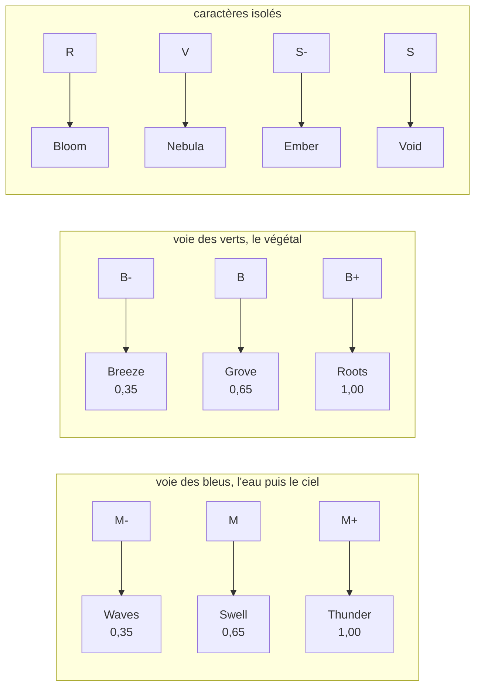

**Cette table est une proposition, pas une règle du domaine.** Elle est tirée de la forme
de la palette — deux voies parallèles, du clair au foncé, plus quatre familles isolées —
et non d'une intention écrite. Elle se corrige famille par famille, à l'écoute.

**L'intensité ne choisit pas le visuel : elle décide s'il part.** Sur un `M-` la moitié
des occasions passe sans rien, ce qui laisse respirer ; sur un `M+` presque tout se
déclenche. La montée d'un set se voit donc à la densité de l'écran autant qu'à sa
couleur.

Les enums partent par leur **nom**, jamais leur rang : un jour une valeur sera insérée au
milieu, et un renderer qui compare des entiers changerait de phénomène sans que rien ne
le signale.

---

## Séparer les sources, et savoir ce qu'on en sait

Douze bandes de fréquence décrivent un spectre ; elles ne décrivent pas une scène. Un kick
et une basse tombent dans la même octave, un piano et un saxophone aussi — et deviennent
alors une seule grandeur, donc une seule forme. Tout ce que l'oreille distingue entre eux
disparaît.

La séparation se fait donc **par le timbre** et non par la fréquence, avec une
factorisation en matrices positives : le spectrogramme récent est décomposé en un petit
nombre de profils spectraux et de leurs activations. Un profil est un timbre ; son
activation dit quand il joue.

> **Rien n'est nommé.** Le système ne décide pas qu'une source est un piano — ce qui joue
> dans une bande change d'un disque à l'autre, et annoncer un piano là où passe un
> saxophone est pire que ne rien annoncer. Il dit seulement si la source est assez stable
> pour porter un nom, et laisse la fiche le poser.

### Deux grandeurs, et elles ne disent pas la même chose

Une seule barre portait les deux, et elle trompait.

| Grandeur | Ce qu'elle mesure | Ce qui la fait monter |
|---|---|---|
| **Assez écoutée** | une durée | le temps de jeu effectif de la source |
| **Nette** | une propriété du disque | son profil se retrouve d'un apprentissage au suivant |

Sur un morceau du crate, les six sources sont **toutes assez écoutées entre 4,2 et 8,8
secondes** — avant la fin des seize temps qui font le palier de travail aux platines. Ce
qui varie ensuite, c'est la netteté, et aucune durée d'écoute n'y change rien : si deux
instruments se relaient dans la même bande, elle restera floue après dix minutes comme
après dix secondes.

Confondues, la source la plus grave affichait zéro après 692 observations. On lisait « le
système n'apprend pas » là où il fallait lire « il a fini d'apprendre, et sa conclusion est
que cette bande est partagée ». **Une mesure et un verdict ne se résument pas au même
chiffre.**

### Six sources, et le chiffre est mesuré

L'intuition dit qu'en demander davantage séparerait mieux. La mesure dit l'inverse.

| Sources | Netteté obtenue | Coût d'un apprentissage |
|---|---|---|
| **6** | **0,87 – 0,99** | **167 ms** |
| 9 | 0,85 – 0,92 | 284 ms |
| 12 | 0,76 – 0,92 | 355 ms |

Passé six, la factorisation n'a plus d'objets à trouver et se met à couper des instruments
en morceaux — des morceaux qui ne se retrouvent plus d'une fois sur l'autre. On paierait
donc deux fois pour un résultat moins bon.

---

## Le parallélisme, et ce que la mesure en a dit

La demande était directe : faire calculer les six sources en parallèle, chacune écrivant sa
part de ce qui part au GPU, sans concurrence à arbitrer puisque chacune est isolée.

La **structure de données** a suivi, et elle en valait la peine. Chaque source possède
désormais son mot de huit octets aligné dans le paquet : niveau, contour, drapeaux,
empreinte, forme, nom. Aucune ne partage un octet avec une autre, ce qui rend l'écriture
concurrente sûre **par la forme des données** plutôt que par un verrou.

Deux défauts sont tombés au passage, et aucun test ne les voyait :

- les six attaques vivaient dans **un seul octet commun** — poser un bit s'y fait en lisant,
  modifiant, réécrivant, donc deux sources écrivant ensemble se seraient effacées ;
- les contours des sources 4 et 5 **n'étaient pas transmis du tout**, ce qui expliquait des
  formes qui pulsaient sur place au lieu de suivre leur mélodie.

### Mais répartir six calculs sur six cœurs coûte plus que de les faire

| Mode | Coût par image |
|---|---|
| séquentiel | **17 µs** |
| parallèle | 160 µs |

Réveiller des fils, distribuer, attendre le dernier : cette dépense est fixe et se compte en
dizaines de microsecondes, quand le travail d'une voie se compte en microsecondes. Le
pipeline sait faire les deux, **mesure lequel gagne sur la machine qui l'exécute**, puis s'en
tient au meilleur. Le jour où chaque voie portera sa propre transformée, la balance
s'inversera d'elle-même sans que le code change.

### Le vrai gain était ailleurs, et il était énorme

L'apprentissage des profils tournait dans le fil d'analyse. Il coûtait **268 ms en moyenne
et 605 ms au pire, toutes les 1,4 seconde**, quand une image d'analyse en dure 21 : treize
images gelées d'affilée, puis rattrapées d'un coup, deux fois par phrase.

| | pire image | images au-dessus du pas de 21 ms |
|---|---|---|
| apprentissage dans le fil | 608 ms | 38 |
| **apprentissage en fond** | **17 ms** | **0** |

Il ne calcule pas plus vite — il calcule exactement aussi vite. Il rapporte parce qu'il
calcule *ailleurs* : l'analyse continue de suivre l'image courante avec les profils qu'elle
a déjà, pendant que les prochains se calculent à côté. Un morceau ne change pas de timbre en
trois secondes.

Un seul fil écrit, un seul lit, et jamais la même chose au même moment : l'analyse dépose une
copie du spectrogramme puis n'y touche plus, l'apprentissage travaille sur ses propres
tableaux et publie un résultat, l'analyse le reprend à l'image suivante. **Le seul état
partagé est un drapeau.** Rien à arbitrer, donc rien à verrouiller.

---

## Ce que le casque transmet aux enceintes

Caler une face au casque, c'est reposer l'aiguille au début plusieurs fois pour vérifier le
tempo. Chacun de ces passages est une écoute de plus du même extrait, et leur cumul dépasse
de loin ce qu'une seule écoute continue donnerait. C'est là que le système apprend le plus,
et c'est justement le moment où personne ne regarde l'écran.

Quand la face calée passe aux enceintes, **ce qu'on a appris la suit**. Le master reprend un
disque déjà décrit au lieu de tout redécouvrir au moment où il en a le moins le temps. C'est
le seul instant du système où quoi que ce soit est recopié — une transition est un geste,
pas une boucle.

**Pendant le fondu, le master suit mais n'apprend plus.** Les deux disques sonnent ensemble
et ce qu'il entend est une somme qui n'existe dans aucun des deux : un portrait formé
là-dessus écraserait celui que le casque vient de transmettre. Le rendu, lui, ne s'interrompt
pas — niveaux, contours et attaques continuent de partir à cadence pleine.

### En mémoire vive, et nulle part ailleurs

Une version rangeait ces portraits sur le disque dur, un fichier par face toutes les dix
secondes : 996 octets, ce qui paraît indolore. La mesure a dit autre chose, sur trois
exécutions de chaque :

| | coût médian d'une image | pire |
|---|---|---|
| avec écriture disque | 3,2 ms | 25 – 34 ms |
| **en mémoire vive** | **2,0 ms** | 17 – 21 ms |

**Soixante pour cent de plus pour ranger un kilo-octet.** Reconnaître un disque la semaine
prochaine ne valait pas d'alourdir la soirée en cours. Une face rangée est oubliée.

---

## Pourquoi pas une bibliothèque existante

La question mérite d'être posée avant d'écrire la moindre FFT, et elle l'a été. Voici
l'état réel du terrain.

| Bibliothèque | Langage | Ce qu'elle couvre |
|---|---|---|
| **Essentia** | C++ | La référence académique : onset, beat, tonalité, HPSS, segmentation |
| **aubio** | C | Onset / pitch / tempo temps réel, léger |
| **madmom** | Python | Beat tracking par réseaux de neurones, état de l'art |
| `NWaves` | **.NET** | FFT, filtres, MFCC, chroma — **ni beat tracking, ni HPSS** |
| `FftSharp` | **.NET** | La FFT seule |

**Le constat :** en .NET il n'existe aucun équivalent d'Essentia ou d'aubio. Pour la
FFT, `FftSharp` aurait fait l'affaire et la nôtre n'était pas indispensable. Pour le
reste — onset, tempo, HPSS, chroma en temps réel — le trou est réel, et les options
étaient d'écrire, ou de passer par du P/Invoke vers du C.

### Le test contre la référence

Plutôt que d'en débattre, on a mesuré. 89 secondes d'`instamata` enregistrées, données
aux deux analyseurs.

| Source | Tempo trouvé | Erreur |
|---|---|---|
| `aubiotrack` (référence C) | 117,1 BPM | **+34,6 %** |
| `aubioonset` brut | 348,7 BPM | +301 % |
| **Emotion Emulator** | **90,4 BPM** | **+3,9 %** |
| *Vérité (fiche du crate)* | *87 BPM* | |

Sans triomphalisme : `aubio` règle le **cas général**, toute la musique confondue. Ce
projet règle **un crate**, et le connaît — écart minimal calé entre la noire et la croche
de 82–97 BPM, repli d'octave vers 70–110, flux limité au registre du kick parce que le
barber beats est plein de souffle et de crépitement de vinyle. Un outil générique ne peut
pas faire ces hypothèses ; ici on le peut.

### Une hypothèse testée, et réfutée

L'explication qui venait naturellement était que la valeur ajoutée tenait aux
**contraintes de domaine**, donc au post-traitement — et qu'on pourrait les appliquer à
n'importe quelle source d'attaques, `aubio` compris. Le test dit non :

| Source | Tempo |
|---|---|
| `aubioonset` + nos contraintes de domaine | 115,4 BPM |
| `aubiotrack` + nos contraintes de domaine | 117,6 BPM |

Aucune amélioration. **L'avantage vient du prétraitement, pas du post-traitement** :
séparer le percussif de l'harmonique, puis ne chercher les attaques que dans le registre
du kick. `aubio` détecte sur le signal complet, attrape donc le piano et les charleys, et
sa grille est décalée dès le départ — aucune règle en sortie ne rattrape cela.

Conséquence pratique : enrichir `aubio` de notre connaissance du répertoire supposerait
d'y injecter le HPSS et le ciblage de registre **en amont** de sa détection, pas des
règles en aval.

### Où le C++ reste justifié

| Étage | Langage | Raison |
|---|---|---|
| Analyse | **.NET** | prouvé suffisant, et plus juste qu'`aubio` sur ce répertoire |
| Transport | mémoire partagée | ~1 µs, aucun runtime supplémentaire |
| **Rendu GPU** | **C++/CUDA** | aucun équivalent .NET — c'est le bon endroit |

Conteneuriser un service d'analyse en Python ou en C ajouterait un second runtime et une
frontière réseau ou IPC, pour un gain nul : l'écriture d'un message coûte aujourd'hui
**2,9 µs**, et une soirée entière a été passée à supprimer un saut de fil pour gagner des
microsecondes. Le langage n'est pas le goulot.

---

## Vers l'unité de rendu externe

Le rendu final tournera dans un **processus séparé**, en CUDA. Le contrat est donc défini
avant le branchement, et il est visible dès aujourd'hui.

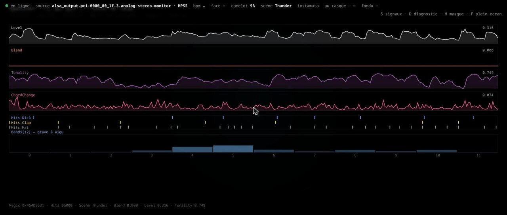

**Touche `S`.** Cet écran ne montre pas un visuel : il montre **le message qui partira**,
champ par champ, sous les noms exacts de `GpuPacket`. Aucune traduction mentale entre ce
qu'on regarde ici et ce qu'on lira de l'autre côté.

### Le contrat : 256 octets, plats

```csharp
[StructLayout(LayoutKind.Explicit, Size = 256)]   // quatre lignes de cache exactement
public struct GpuPacket
{
    [FieldOffset(0)]   public uint  Magic;      // 0x454D5531 — "EMU1"
    [FieldOffset(4)]   public uint  Sequence;   // un saut = messages perdus, c'est permis
    [FieldOffset(8)]   public long  TimeMs;
    [FieldOffset(16)]  public float Level;
    [FieldOffset(20)]  public float Bpm;        // 0 = pas encore accroché
    [FieldOffset(40)]  public byte  Hits;       // bit 0 kick · 1 clap · 2 hat
    [FieldOffset(48)]  public Bands12 Bands;    // douze flottants en ligne

    // Huit octets par source, alignés : niveau, contour, drapeaux, nom, écoute,
    // netteté, brillance, forme. Aucune source ne partage un octet avec une autre.
    [FieldOffset(128)] public SourceBlock Sources;

    [FieldOffset(192)] public float BpmExpected;  // ce que la fiche affirmait
    [FieldOffset(196)] public float TempoDrift;   // décalage accumulé, en temps
    [FieldOffset(204)] public float BpmAnnounced; // la dernière annonce
}
```

**Chaque source a son mot, et c'est ce qui rend l'écriture concurrente sûre.** La
disposition précédente rangeait les six attaques dans un seul octet commun : poser un bit
s'y fait en lisant, modifiant, réécrivant, donc deux sources écrivant ensemble se seraient
effacées sans que rien ne le signale. Séparer les données remplace l'arbitrage.

Chaque décision sert la latence :

| Choix | Raison |
|---|---|
| `LayoutKind.Explicit` | l'ordre en mémoire est celui écrit, pas celui que le compilateur trouve commode — un lecteur CUDA mappe la même structure sans négocier |
| Taille fixe, **aucun type référence** | la structure peut vivre en mémoire partagée entre deux processus ; un `float[]` est une référence dans le tas d'un processus, invisible depuis l'autre |
| `InlineArray` pour les bandes | douze flottants en ligne, sans indirection ni allocation par message |
| Masque de bits pour les attaques | trois booléens dans un octet |
| Zéro pour « pas de valeur » | CUDA n'a pas de notion de valeur absente ; c'est documenté dans le contrat |

256 octets à 47 messages par seconde font 12 Ko/s : **la bande passante n'est pas le
sujet, la latence l'est**, et une structure plate se lit d'un bloc.

### L'anneau partagé, sans verrou

Le transport vers le processus CUDA. Un socket coûte 10 à 20 µs par message, en appels
système et copies à travers le noyau ; ici les deux processus écrivent et lisent **la
même page physique**.

```
┌──────────────────────── /dev/shm/emotion-emulator ────────────────────────┐
│ en-tête 192 o                              │ 256 cases × 96 o            │
│ magic │ capacity │ slotSize │ … │ write ⏎  │ … │ read ⏎  │ [0][1][2]…[255] │
│   0       4          8              64          128                       │
└───────────────────────────────────────────────────────────────────────────┘
        write et read ont chacun leur ligne de cache (64 o d'écart)
```

Trois décisions, et chacune répond à un piège précis :

**1. L'ordre des écritures est tout.** On écrit la case, *puis* on avance le curseur,
avec une barrière entre les deux :

```csharp
*(GpuPacket*)slot = packet;                              // 1. la donnée
Volatile.Write(ref *(long*)(_base + 64), w + 1);         // 2. barrière, puis curseur
```

Sans cette barrière, le processeur ou le compilateur sont libres de publier le curseur
avant la donnée — et le lecteur voit une case à moitié écrite, dont la moitié appartient
à l'image précédente. **C'est le genre de défaut qui n'apparaît qu'une fois sur mille et
jamais sur la machine de celui qui l'a écrit.** Un test le vérifie sur 200 000 messages
en concurrence, chaque champ étant dérivé du numéro de séquence : zéro incohérence.

**2. Les curseurs sont espacés d'une ligne de cache.** Sans cet espacement, `write` et
`read` partageraient la même ligne, et chaque écriture de l'un invaliderait le cache de
l'autre. C'est le **faux partage**, et il coûte plus cher qu'un verrou bien placé.

**3. Le producteur n'attend jamais.** Quand le consommateur prend du retard, on écrase.
Il s'en aperçoit par un saut du numéro de séquence — une information utile plutôt qu'une
panne. Un lecteur qui se rebranche en plein set démarre sur l'instant présent, pas sur
les cinq dernières secondes.

### Ce que la mesure a coûté, et rapporté

`/health` expose le coût réel d'un message. Le premier chiffre était mauvais, et c'est
en le regardant qu'on a trouvé pourquoi :

| Étape | Moyenne | Ce qui n'allait pas |
|---|---|---|
| première mesure | 22,4 µs | `ParseHex` de la couleur **à chaque message** |
| couleur mise en cache | 14,1 µs | `Scene.ForFamily` = un switch **sur chaîne** à chaque message |
| scène mise en cache, `Release` | **4,2 µs** | — |

Une valeur qui ne change qu'au changement de face n'a rien à faire sur un chemin
parcouru 47 fois par seconde. Les deux calculs sont désormais faits une fois, à la
construction de `TrackContext`.

Le pire cas est passé de 7,5 ms à 3,2 ms en pré-touchant les pages à l'ouverture — une
mémoire mappée n'est matérialisée qu'au premier accès, et le défaut de page tombait donc
en plein set.

**Et un maximum brut ne dit rien d'utile** : un seul incident au démarrage le fixe pour
toute la soirée. On compte donc les dépassements :

```json
{ "messages": 1822, "ecritureMoyenneUs": 4.22,
  "ecriturePireUs": 3194.4, "depassements100us": 1, "depassements1ms": 1 }
```

**Un** dépassement sur 1822 messages, au tout premier passage : c'est le JIT, pas un
défaut structurel.

### Le bus de diffusion

Dès qu'il y a deux consommateurs, un seul chemin ne tient plus : le plus lent dicterait
la cadence du plus rapide, et une unité GPU occupée ferait sauter le visuel web.

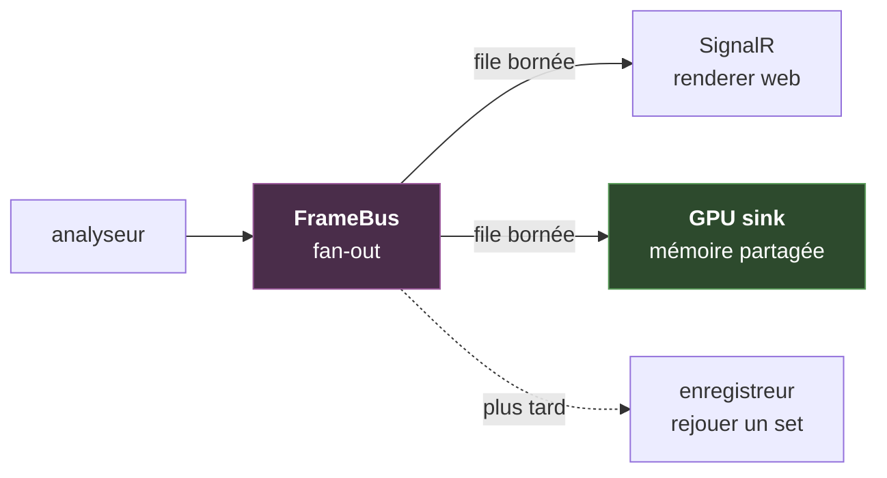

**La règle, propre au temps réel :** quand une file déborde, on jette la **plus
ancienne** image, jamais la nouvelle, et on ne bloque **jamais** le producteur. Une image
de 21 ms arrivée en retard n'a aucune valeur — la suivante est déjà meilleure. Bloquer
pour la livrer reviendrait à ajouter du retard à tout le monde pour satisfaire le plus
lent.

Aucun verrou sur le chemin chaud : `Channel` en mode un producteur / un consommateur
n'utilise que des opérations atomiques, et `Publish` ne fait que des écritures qui ne
peuvent pas échouer. Les abonnements, eux, sont rares — quelques-uns au démarrage — donc
la liste d'abonnés est recopiée sous verrou et lue sans.

Les pertes sont **comptées**, par abonné : un visuel qui saccade sans explication est
indébogable.

---

## L'écran de réglage

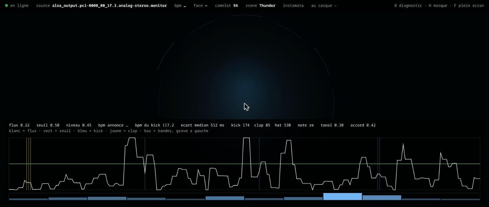

**Touche `D`. On ne règle pas ce qu'on ne voit pas.**

Et **touche `C`** pour l'écran de calage : tout y est immobile **sauf ce que le son
déclenche** — un disque pour le kick, un carré pour le clap, un trait pour le charley,
plus la grille du tempo. Dans un visuel où tout bouge en permanence, l'œil ne sait pas
dire ce qui est déclenché par le son et ce qui dérive tout seul. Là, si une forme
s'allume en même temps que la frappe s'entend, c'est calé ; si elle traîne, ça se voit
sans rien mesurer.

Il montre l'enveloppe qui décide vraiment — celle du kick — le seuil adaptatif en vert,
chaque attaque en trait vertical coloré par registre, les douze bandes, et l'écart médian
converti en BPM.

C'est l'outil qui a permis de passer de **341 BPM implicites à 87,8 mesurés**, en quatre
diagnostics successifs :

| Constat à l'écran | Cause | Correction |
|---|---|---|
| 4 attaques par temps | flux calculé sur tout le spectre, saturé par le souffle et le crépitement de vinyle | flux limité au registre du kick |
| écart médian ≈ écart minimal | pas de condition de maximum local | exiger un sommet, pas un franchissement |
| `kick 80` et `clap 81` aux mêmes instants | tranches de registre qui se chevauchaient | tranches disjointes + dominance du médium |
| courbe en dents de scie | flux brut d'une fenêtre à l'autre | moyenne mobile à deux termes |

> Une version affichait le flux **global** alors que les attaques venaient des enveloppes
> **par registre**. Un outil de réglage qui montre autre chose que ce qui décide est pire
> qu'aucun outil.

---

## L'écosystème : trois pièces, trois responsabilités

Le moteur ne fait pas tout, et c'est délibéré. Chaque pièce sait une chose que les deux
autres ne peuvent pas savoir.

```
   ┌──────────────┐  fiche du disque : famille, Camelot,   ┌──────────────────┐
   │              │  couleur, forme voulue par source      │                  │
   │    crate     │ ────────────── HTTP ─────────────────► │ emotion-emulator │
   │  (le bac)    │                                        │   (l'analyse)    │
   │              │ ◄───────────── HTTP ────────────────── │                  │
   └──────────────┘  feu vert : « ce disque est connu »    └────────┬─────────┘
                                                                    │
                                                        paquet de 256 octets
                                                        /dev/shm, sans verrou
                                                                    │
                                                                    ▼
                                                           ┌──────────────────┐
                                                           │ emotion-renderer │
                                                           │   (CUDA, à venir)│
                                                           └──────────────────┘
```

### crate — ce que le signal ne dira jamais

[**crate**](https://github.com/LiquidSnake0/crate) est la base du bac de disques. Elle porte
ce qui ne s'entend pas ou se détecte mal : la famille du morceau, le Camelot, la couleur, et
désormais **la forme voulue pour chaque source**.

Ce dernier point est un choix d'architecture. Le moteur sait séparer six sources et décrire
chacune ; il ne sait pas, et n'a pas à savoir, laquelle mérite une bouche plutôt qu'un
anneau. Ce choix est musical et dépend du morceau — sur une face feutrée c'est la voix qu'on
veut voir respirer, sur une face dense c'est la frappe. Le fixer dans le code imposerait la
même lecture à tout un bac.

Le moteur **transporte** donc la forme, il n'en décide pas : un octet par source, qui part au
GPU dès la première image sans attendre que la source se soit décrite. Une fiche muette
laisse l'ordre par défaut, du grave à l'aigu — ce n'est pas un choix musical, seulement ce
qui garantit que six sources restent distinguables.

Les deux se parlent par HTTP et **ne fusionnent pas**. Une commande est rare, doit être
acquittée et peut échouer ; un événement est continu et sa perte est sans conséquence. Ce
sont deux besoins opposés, donc deux canaux.

### emotion-renderer — ce qui viendra derrière

Le rendu tourne aujourd'hui en Canvas 2D dans un navigateur, entièrement en caractères
monospace : une chaîne par ligne, un remplissage par chaîne. Ce n'est pas un pis-aller, c'est
une décision de mesure — réduit à du texte, le rendu devient trop rapide pour qu'un retard
perçu puisse venir de lui, et ce qui reste se mesure ailleurs.

C'est aussi ce qui prépare l'unité externe. Un GPU qui affiche une grille de caractères n'a
rien à réimplémenter : il lit une matrice et l'affiche. Le contrat est déjà écrit et déjà
alimenté — **256 octets plats**, poussés dans un anneau sans verrou en mémoire partagée,
avec un coût d'écriture de 1,5 µs. Le renderer CUDA se branchera dessus sans que l'analyse
change d'une ligne.

---

## Faire tourner

```sh
# Signal fabriqué, aucun matériel requis
dotnet run --project src/Emotion.Server

# Écoute réelle : ce qui sort des haut-parleurs
Signal__Source=pulse \
Signal__Device=$(pactl list short sources | grep monitor | head -1 | cut -f2) \
dotnet run --project src/Emotion.Server

# Avec la sortie casque de la table sur l'entrée ligne
Signal__CueDevice=alsa_input.pci-0000_00_1f.3.analog-stereo \
dotnet run --project src/Emotion.Server
```

`http://localhost:5299` · `F` plein écran · `D` diagnostic · `H` masque le bandeau —
il ne doit jamais finir sur le mur.

```sh
curl -X POST localhost:5299/deck/play -H 'Content-Type: application/json' -d '{
  "title":"instamata","disc":"haircuts for men","side":"",
  "camelot":"9A","family":"M+","colorHex":"#154360","coverUrl":null}'

curl -X POST localhost:5299/deck/cue  -H 'Content-Type: application/json' -d '{
  "title":"Dreamcast Nostalgia","disc":"macintosh plus","side":"B",
  "camelot":"8A","family":"M-","colorHex":"#7FB3D5","coverUrl":null}'

curl -X POST localhost:5299/deck/take
```

```sh
dotnet test        # 128 tests
```

### Les images et les clips

Le dépôt ne contient **aucune œuvre**. `assets/manifest.json` est versionné, les fichiers
qu'il décrit ne le sont pas — des vidéos dans un dépôt git le rendent inutilisable en
trois commits, et du matériel sous copyright dans un dépôt public devient une pièce à
charge plutôt qu'une démonstration.

```json
{ "file": "clips/pluie.webm", "kinds": ["Thunder", "Swell"],
  "weight": 3, "blend": "screen", "every": 4 }
```

Le déclenchement suit les **attaques**, jamais un minuteur : un clip parti sur le clap
reste calé même si le disque est pitché. Sans dossier d'assets, la bibliothèque reste
inerte et la géométrie tourne seule.

---

## Structure

| Projet | Rôle | Dépendances |
|---|---|---|
| `Emotion.Signal` | modèle, analyse, sources | **aucune** — ni web, ni paquet tiers |
| `Emotion.Server` | hub, endpoints, rendu servi en statique | ASP.NET Core, SignalR |
| `Emotion.Signal.Tests` | 128 tests | xUnit |

Le cœur ne dépend de rien : la FFT, la détection d'attaques, l'estimation de tempo,
l'analyse harmonique, la mesure de fondu et le modèle des platines se testent **sans
serveur, sans carte son et sans navigateur**.

---

## Ce qui reste

- **Signature par événement** — centroïde spectral, largeur de bande et temps de
  décroissance suffisent à ranger un son dans une famille générique sans avoir à le
  nommer.
- **Structure du morceau** — densité et énergie sur fenêtre glissante, détection de
  rupture pour repérer les sections.
- **Le détecteur d'attaques reste le maillon faible.** Sur un répertoire aux kicks
  étouffés, 28 % seulement des intervalles entre frappes tombent sur un temps entier. Régler
  l'écart minimal sur le tempo plutôt que sur une constante a fait passer ce chiffre de 23 à
  28 % et les frappes bien calées de 12 à 20 %, mais filtrer ne crée pas les détections
  manquantes. L'horloge à verrouillage de phase compense — elle n'excuse pas.
- **Le pas d'annonce du tempo est plus fin que la résolution de la mesure.** L'annonce part
  tous les 0,68 BPM, calculé pour être visible sur seize temps ; entre deux périodes
  candidates de l'autocorrélation il y a pourtant 2,8 BPM à 87. L'interpolation parabolique
  rattrape en partie, le reste est à revoir.
- **Nommer les sources depuis la fiche** — le transport existe, l'interface dans crate non.
- **Les huit phénomènes non dessinés.**
- **Le mapping proprement dit** — déformation par homographie pour caler l'image sur la
  surface physique projetée.
- **Passage à WebGL** quand il y aura une carte graphique en face.
